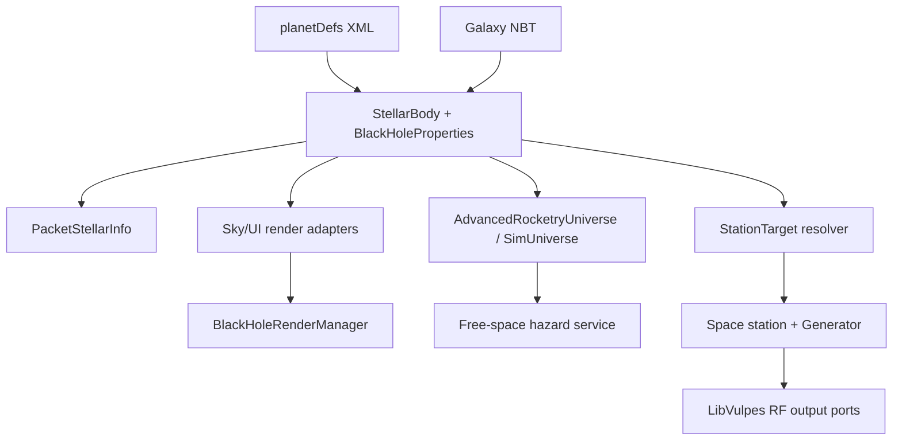

# Kerr Black Hole 与 Black Hole Generator Backport 实施规格

状态：Implementation-ready  
目标分支：`MC1.7`  
审查基线：`9abfeab22708cec44b089fbea49ce535e67a4cfd`（tag `1.4.1`）  
配套仓库：`zerozaki666/libVulpes-Continuation`  
目标运行时：Minecraft 1.7.10、Forge `10.13.4.1614`、Java 8

## 1. 执行摘要

本项目分成两个明确层级：

1. **1.12.2 parity backport**：移植上游真实存在的黑洞恒星标记、存档/XML/星图/空间站目标、基础 PNG 渲染和 Black Hole Generator。
2. **Continuation extension**：在现有 TFRU `SimUniverse`/free-space 基础上新增黑洞危险区，并以具备降级路径的屏幕空间 shader 重新实现 Kerr 风格视觉。

二者不能混写。上游 1.12.2 的黑洞并不是 Kerr ray marcher：它只是 `StellarBody.isBlackHole` 加若干旋转 PNG quad。上游发电机也不是“质量 × 吸积率 × 效率”，而是在空间站直接环绕黑洞主星时，以固定 `500 × blackHoleGeneratorMultiplier` RF/t 工作。

实施后的职责边界为：

- AdvancedRocketry：天体数据、导航、空间站资格、free-space 危险行为、黑洞发电机、天空和机器渲染。
- LibVulpes：通用多方块、item/power ports、RF 聚合、GUI、NBT 和 `PacketMachine`。
- LibVulpes 不新增任何黑洞专用 API。

## 2. 审查基线与来源

| 来源 | 基线 | 用途 |
|---|---|---|
| `zerozaki666/AdvancedRocketry-Continuation` | `MC1.7@9abfeab` | 实际落点；已包含 TFRU free-space/SimUniverse |
| `zerozaki666/libVulpes-Continuation` | `unstable1_7@59e9639` | 多方块、RF、GUI 和网络基础 |
| upstream AdvancedRocketry | `1.12@c5cd5af62fc07cd4e0d24f06a16033f181c47c04` | 黑洞 bool、PNG renderer、generator 行为和资源 |
| upstream LibVulpes | `1.12@c2ca79dc18625c9e63a191a795f1f07d078f29f0` | best-effort refreshing item-port getter 参考 |
| 初版文档 | `Kerr Black Hole & Black Hole Generator Backport.md` | 产品目标和期望视觉 |
| 目标整合包清单 | `loadedmod.csv` | Angelica、MatterOverdrive CE、CoFH/RF、Thermal、IC2、GregTech、EnderIO、Galacticraft、NEI 等兼容矩阵 |

上游相关代码与资源来自 MIT 仓库；Continuation 仓库包含 AGPL-3.0 与历史 `LICENSE-MIT`。复制上游 Java、PNG 或 OBJ 时必须记录源仓库、源提交与本地改动，不得移除既有许可文件。不能直接复制 MatterOverdrive 的 shader 或资源，除非另外核实其许可并记录 provenance。

## 3. 初版方案审查与修正

| 初版内容 | 审查结论 | 本规格的处理 |
|---|---|---|
| `StellarObject -> Star/Planet/BlackHole` 继承体系 | 当前 1.7.10 不存在该模型 | 增量扩展 `StellarBody`，不改行星类型体系 |
| `StellarObjectType.BLACK_HOLE` | 上游没有此枚举 | 存档继续使用 `isBlackHole` bool；sim 层可有兼容扩展类型 |
| `BlackHoleData(mass, spin, radius, accretionRate)` 是 backport | 上游只有 bool | bool 属 parity；Kerr 参数属于 Continuation extension |
| `IBlackHolePowerProvider` | 两版 LibVulpes 均不存在 | 删除；generator 直接继承 `TileMultiPowerProducer` |
| `TileMachineBlackHole` | 上游不存在且基类方向错误 | 删除 |
| `Power = mass × accretion × efficiency` | 非上游行为 | 第一版固定 500 RF/t × config；物理耦合仅列未来选项 |
| 普通/高级奇点燃料和升级 | 上游没有 | 不进入 MVP |
| 1.12 已有 Kerr lensing、Doppler、photon ring | 不成立 | 明确作为新的近似 shader 设计 |
| “扁平化事件视界” | 物理表述不准确 | 渲染 apparent shadow/critical curve；不把 horizon 画成扁椭圆 |
| TFRU free-space 从零实现 | 当前 fork 已实现 | 只做类型、危险区和 renderer 集成 |
| 已有碰撞可直接复用 | 只检测 landable body，且为离散点检测 | 保留行星着陆语义，新增 swept-sphere 黑洞命中 |
| UE、RF、LibVulpes network 全兼容 | UE 不存在；IC2 不是 generator 输出 | 只承诺 CoFH RF 与现有 AR RF pipe |

## 4. 目标、非目标与发布边界

### 4.1 必须达到

- 顶级主星可被声明为黑洞；
- 老世界、老 XML 和普通恒星行为保持兼容；
- 黑洞状态通过 NBT、XML、登录同步和 `SimUniverse` 一致传播；
- 星图和相关 UI 使用黑洞图标；
- 空间站可选择并直接环绕黑洞主星；
- Black Hole Generator 在正确空间站位置按明确状态机工作；
- 行星天空、空间站天空、free-space 和 UI 均不会把黑洞画成普通太阳；
- Kerr 风格 renderer 有可靠的 shader/fixed-function 降级；
- free-space 黑洞危险行为由配置控制并由服务器权威处理；
- dedicated server 不加载 LWJGL、shader 或 client renderer 类。

### 4.2 明确不做

- 不实现完整 Kerr metric 的数值 geodesic solver；
- 不宣称视觉近似具备科研精度；
- 不把黑洞创建为独立 Forge dimension；
- 不让普通火箭把恒星当作可着陆维度；
- 第一版不为子恒星创建独立导航 ID、碰撞体或发电资格；
- 不把质量、自旋或吸积率接入 generator 基础输出；
- 不加入 generator upgrade、singularity fuel、Penrose/Dyson 玩法；
- 不新增 Universal Electricity 或 IC2 generator output；
- 不要求外部 shader pack；
- 不让任意一个黑洞继续透镜另一个黑洞，避免第一版的 FBO ping-pong。

## 5. 总体架构



### 5.1 权威性

- 服务端权威：天体存档、空间站目标、危险区、火箭运动、capture、generator 状态、燃料和 RF。
- 客户端派生：Kerr shader、LoD、动画、屏幕尺寸和 UI 文本。
- 共享确定性：恒星参数、world time、`SimUniverse` 坐标。

### 5.2 两种黑洞必须分离

| 对象 | 含义 | 生命周期 |
|---|---|---|
| Astronomical black hole | `StellarBody`，银河中的真实天体 | galaxy save/XML/network |
| Generator machine/energy animation | 多方块 OBJ 与运行时黄色能量动画 | controller TileEntity |

上游 generator TESR 不含局部黑洞：它只画机器 OBJ，并在发电时画两个黄色加色 cuboid。若未来加入局部黑色核心，那是新的 Continuation 视觉扩展；无论是否加入，它都不是 `SimUniverse` 天体，不参与导航、引力或碰撞。

## 6. 恒星数据模型

### 6.1 不引入新的天体继承树

修改：

`src/main/java/zmaster587/advancedRocketry/api/dimension/solar/StellarBody.java`

最低 parity API：

```java
public boolean isBlackHole();
public void setBlackHole(boolean blackHole);
```

新增：

`src/main/java/zmaster587/advancedRocketry/api/dimension/solar/BlackHoleProperties.java`

Continuation extension API：

```java
@Nullable
public BlackHoleProperties getBlackHoleProperties();

public BlackHoleProperties getOrCreateBlackHoleProperties();
```

`StellarBody` 仍是唯一恒星类。普通恒星不分配或不序列化额外 compound，nullable getter 对普通恒星返回 null。`setBlackHole(true)` 和读取旧 `isBlackHole=true` 时创建 deterministic defaults；`getOrCreate...()` 只允许在 `isBlackHole()==true` 后调用，否则抛出明确的 `IllegalStateException`。`setBlackHole(false)` 清除 runtime profile，保存时也不写遗留 compound。

### 6.2 BlackHoleProperties v1

| 字段 | 类型 | 默认值 | 有效范围/语义 |
|---|---:|---:|---|
| `schemaVersion` | int | `1` | 数据格式版本 |
| `mass` | double | `max(size², 0.01)` | `SimUniverse` 质量单位；与视觉尺寸分离 |
| `spin` | double | `0` | 无量纲 \(a_*\)，clamp 到 `[0, 0.998]` |
| `accretionRate` | double | `0.25` | 归一化视觉/照明强度 `[0,1]`，不是 SI 单位 |
| `spinAxisInclinationDeg` | double | `0` | 有向 spin axis 相对世界 +Y 的倾角 `[0,180]` |
| `spinAxisYawDeg` | double | `0` | 绕世界 +Y、从 +Z 朝 +X 的右手方位角 `[0,360)` |
| `hasDiskInnerRadiusOverride` | boolean | `false` | false 时自动使用 ISCO |
| `diskInnerRadiusOverM` | double | 未定义 | 仅 override=true 时有效；单位是 \(GM/c^2\)，不是 metre |
| `diskOuterRadiusOverM` | double | `20` | 同为 \(GM/c^2\) 单位，必须大于 effective inner |
| `visualScale` | double | `1` | 只影响天空角尺寸，必须 `>0` |
| `captureRadius` | double | `max(2, size×4)` | free-space blocks；不由 visualScale 隐式改变 |
| `influenceRadius` | double | `capture×16` | 可选引力区域，必须 `>= capture` |
| `warningRadius` | double | `influence×1.25` | HUD 警告区域，必须 `>= influence` |

设计约束：

- `size` 保持现有星图/天空的 legacy 尺寸；
- `mass` 可影响子天体轨道角速度，但不改变 GUI 大小；
- capture/influence/warning 是游戏尺度，不伪装成 SI event horizon；
- Kerr 的 \(r_+\)、ISCO 和 critical curve 只用于 renderer 的归一化几何；
- spin axis 是有方向的单位向量，非负 `spin` 按右手定则定义盘的顺行方向；第一版不支持 counter-rotating disk；
- 所有 setter 和 decode 都要拒绝 NaN/Infinity；
- 先计算 effective inner，再要求 `outer > inner + epsilon`；不能先把 outer clamp 到 64 后留下 `inner >= outer`；
- 同一恒星的一组 fallback 必须只由已存数据和恒星 ID 决定，不能使用 `Math.random()`。

### 6.3 质量兼容

现有：

```java
getMass() = max(size * size, 0.01F)
```

公开 ABI 保持：

```text
float getMass()：签名和现有 max(size², 0.01) 语义不变
```

新增：

```java
public double getSimulationMass();
```

新方法对黑洞返回 sanitized profile mass，否则返回现有 `getMass()`。只有 `AdvancedRocketryUniverse.SimStar`、危险区和明确的物理扩展使用它。不得把 `getMass()` 的返回类型从 `float` 改成 `double`，否则会破坏 addon 的源码和二进制兼容。

## 7. NBT、XML、网络与迁移

### 7.1 NBT schema

继续写上游兼容根键：

```text
isBlackHole: boolean
```

Kerr extension 使用独立 compound：

```text
blackHoleData: {
  schemaVersion: int,
  mass: double,
  spin: double,
  accretionRate: double,
  spinAxisInclinationDeg: double,
  spinAxisYawDeg: double,
  diskInnerRadiusOverM: double,    # 仅显式覆盖时写；存在即 hasOverride
  diskOuterRadiusOverM: double,
  visualScale: double,
  captureRadius: double,
  influenceRadius: double,
  warningRadius: double
}
```

读取规则：

1. 无 `isBlackHole`：按普通恒星读取，所有旧世界保持原行为；
2. `isBlackHole=true` 但无 compound：创建 deterministic defaults；
3. compound 缺字段：逐字段默认，不整组丢弃；
4. 未来未知字段：忽略并保留当前可理解字段；
5. 非法值：每颗星/每类问题只警告一次并回退；
6. `isBlackHole=false` 时忽略遗留 compound，保存时不再写该 compound；
7. 现有 `seperation` NBT key 必须继续读写，不能借机无迁移地改名。

decode 顺序必须先恢复 `size`，再创建缺省 profile；XML 同样先解析 size，再解析 `blackHole`/profile。这样缺失 mass/capture 半径的 fallback 才基于最终 legacy size。首次将“只有 bool”的旧数据保存为 v1 compound 后，resolved defaults 固定并持久化；后续单独改 visual size 不会暗中改变 gameplay mass/hazard radii。

`DimensionManager.saveDimensions/loadDimensions` 已经保存整个 `StellarBody` NBT，无需新建 galaxy save 文件。

### 7.2 XML schema

修改 `util/XMLPlanetLoader.java` 的：

- `readStar`
- `readSubStar`
- `readAllPlanets`
- `writeXML`

顶级和嵌套 `<star>` 都支持：

```xml
<star
  blackHole="true"
  blackHoleMass="4.0"
  blackHoleSpin="0.92"
  blackHoleAccretionRate="0.65"
  blackHoleAxisInclination="8"
  blackHoleAxisYaw="35"
  blackHoleDiskInnerRadiusOverM="auto"
  blackHoleDiskOuterRadiusOverM="24"
  blackHoleVisualScale="1.0"
  blackHoleCaptureRadius="8"
  blackHoleInfluenceRadius="128"
  blackHoleWarningRadius="160" />
```

规则：

- `blackHole` 缺失/false 表示普通恒星；
- 所有扩展属性可省略；
- writer 始终写 canonical `blackHole`，只为黑洞写扩展属性；
- reader 同时接受既有 `seperation` 和修正拼写 `separation`，writer 暂时继续写 `seperation` 以保持生态兼容；
- 保持旧二维坐标语义以及 `coordinateSchema="xyz"`；
- name 和其他字符串属性必须做 XML escaping；
- 错误属性不应使整个 galaxy 加载失败，应记录 star name、attribute 和 fallback。

`AdvancedRocketry.java` 中 `resetPlanetsFromXML`/XML 覆盖已有恒星的逐字段复制路径，也必须复制 `isBlackHole` 和完整 profile，否则重置会静默丢数据。

### 7.3 网络

`network/PacketStellarInfo.java` 已传输完整 `StellarBody` NBT。扩展 `writeToNBT/readFromNBT` 后不新增 packet。

客户端接收顺序保持：

1. 登录时先收 stars；
2. 再收 dimensions；
3. `PacketStellarInfo#executeClient`/`PacketDimInfo` 刷新 `AdvancedRocketryUniverse`；
4. 同时清除/重建 station-target resolver cache 和 renderer profile cache。

新增任何 packet discriminator 时只能追加到注册表末尾，不能插入现有序号中间。

服务端的 star add/remove、`setBlackHole`、XML reset 和 admin mutation 也必须主动 invalidate resolver cache；不能只处理客户端 packet。

### 7.4 子恒星支持边界

当前 `StellarBody.subStars` 没有独立稳定 ID，`AdvancedRocketryUniverse.refresh()` 也只注册顶级恒星。第一版规定：

- 子恒星可以分别保存 `isBlackHole/profile`；
- 行星/空间站天空与 UI 必须按每个 sub-star 自己的类型渲染；
- 不重复上游 `RenderAsteroidSky` 把主星类型错误传给子星的 bug；
- 子黑洞不进入 free-space collision/hazard；
- 子黑洞不是独立 warp target；
- generator 只认直接环绕的顶级黑洞主星。

后续若支持子星物理，必须先设计 `(primaryStarId, childIndex或UUID)` 的稳定标识和真正的 binary orbit，不能复用主星 ID 假装独立。

## 8. 亮度、温度与普通恒星回归

`StellarBody#getColor` 和 `AstronomicalBodyHelper` 当前假设对象是发光恒星。黑洞天空颜色不由普通恒星 temperature RGB 决定，但 parity 与新物理扩展必须分开。

先定义现有公式：

\[
L_{\mathrm{legacy}}(star,d)=
\frac{size^2(temperature/100)^4}{(d/100)^2}
\]

**默认 `UPSTREAM_COMPAT` 模式**精确采用 1.12 行为：

```text
allComponentsAreBlackHoles =
    primary.isBlackHole()
    && every subStar.isBlackHole()

stellarBrightness =
    L_legacy × (allComponentsAreBlackHoles ? 0.25 : 1.0)
```

上游不会累加各 sub-star 的 luminosity，也不会按 accretion rate 重算平均温度；`getAverageTemperature` 在此模式继续走现有 size/temperature 公式。

可选 Continuation extension：

```text
blackHoleLuminosityMode = UPSTREAM_COMPAT | ACCRETION_RATE
```

在 `ACCRETION_RATE` 且 `allComponentsAreBlackHoles` 时：

```text
factor = clamp(primary.blackHoleProperties.accretionRate, 0, 1)
stellarBrightness = L_legacy × factor
averageTemperature = legacyAverageTemperature × factor^(1/4)
```

`factor=0` 时温度结果明确为 0，并在所有中间计算后做 finite guard；存在任意 normal sub-star 时第一版仍用 factor 1，保持上游混合系统行为。普通恒星数值和纹理必须与基线一致。第一版不把 `temperature` 重解释为 Hawking temperature。

## 9. Synthetic star target 与空间站导航

### 9.1 选择：忠实 backport 直接环绕黑洞

上游 generator 的资格是“空间站直接环绕黑洞主星”，不是“位于黑洞星系任意行星上空”。本规格选择移植上游 synthetic star target，而不是降低为 planet-host-star 检查。

这是一项跨模块改动，必须先完成导航测试，再合入 generator。

### 9.2 ID、StationTarget 与局部 proxy

在 `api/Constants.java` 增加：

```java
public static final int STAR_ID_OFFSET = 10000;
```

并把 `ModulePlanetSelector` 的本地 `starIdOffset` 替换为该常量。

规则：

- 首选兼容编码是 `STAR_ID_OFFSET + stellarBody.id`；
- 若首选编码已被真实 AR/Forge dimension 占用，则使用
  `Integer.MIN_VALUE + 1 + stellarBody.id` 的可逆备用编码；
- 该 ID 不是 Forge dimension ID；
- 已存在的真实 dimension 永远优先，不拒绝、不迁移、也不丢弃
  `>= STAR_ID_OFFSET` 的合法世界；外部 Forge dimension 若没有 AR
  `DimensionProperties` 则 fail closed，不得冒充 star target；
- **保持** `DimensionManager#getDimensionProperties(int)` 的现有全局契约，不让它承担 star proxy；该方法约有大量普通调用点，并会把未知 ID 回退为 overworld；
- 新增空间站专用 `StationTargetResolver`，所有 station target 的解析、验证和显示都从这里进入；
- resolver 返回明确的 `DIMENSION / BLACK_HOLE_STAR / WARP / INVALID`，无效 ID 绝不能回退 overworld；
- resolver 的 proxy cache 按 raw target ID 缓存，在 star packet、XML reset 和 world unload 时失效。

建议类型：

```java
public final class StationTarget {
    public enum Kind { DIMENSION, BLACK_HOLE_STAR, WARP, INVALID }
    // raw id、kind、nullable dimension properties、nullable stellar body
}

public final class StationTargetResolver {
    public StationTarget resolve(int rawId);
    public StationTarget resolveCurrentBody(World world, int x, int z);
    public int getSelectorId(int stellarId);
    public boolean isAllowedDestination(int rawId, EntityPlayerMP actor);
}
```

resolver：

1. 先识别 `WARPDIMID`；
2. 优先接受存在 AR `DimensionProperties` 的真实 dimension；
3. 已由 Forge 注册但没有 AR properties 的 ID 返回 `INVALID`；
4. 再尝试解码首选或备用 star ID，并反查存在的顶级 `StellarBody`；
5. 只有主星 `isBlackHole()` 才返回 `BLACK_HOLE_STAR`；
6. normal star、sub-star、编码冲突、越界、溢出与未知 ID 全部返回 `INVALID`。

`DimensionProperties` 增加：

```java
public boolean isStar();
public StellarBody getStarData();
```

并调整：

- `getStar()`：proxy 返回 `getStarData()`；
- `getPlanetIcon()`：black-hole proxy 返回 `blackhole_icon.png`；
- station/proxy 的 parent 查询调用 `StationTargetResolver`，普通 planet/moon 路径仍调用 `DimensionManager`；
- 不把 proxy 加入 `StellarBody.planets`；
- 不给 proxy 发 `PacketDimInfo`；
- 不向 Forge 注册 proxy dimension。

当前分支没有可直接复用的 `DimensionProperties#hasSurface()`，本功能不新增这一全局概念。普通 rocket 继续使用现有 `DimensionManager#canTravelTo()`；station destination 只使用 resolver。

### 9.3 选择器与 warp

`ModulePlanetSelector` 增加 `allowStarSelection`，默认 false：

- 所有 star 都可用于进入/查看系统；
- 普通火箭、planet selector 和着陆选择器不能确认任何 star；
- 空间站 warp monitor 只设置 `allowStarSelection=true`；
- 即使允许，也只能确认 `isBlackHole()` 的 star；
- 黑洞使用 icon 和明确 tooltip，例如“Black hole / station orbit target / not landable”；
- normal star 继续不可确认。

`allowStarSelection` 只是客户端 UI 提示，不是安全边界。`TileWarpShipMonitor#useNetworkData` 对客户端发来的 selection/focus（现有 id 1/3）以及真正 warp（现有 id 2）都必须在服务端重新调用 resolver，验证：

- raw ID 对应允许的 target；
- synthetic ID 对应存在的顶级黑洞；
- normal star、sub-black-hole、unknown ID 均拒绝；
- 发包玩家正在使用该 station/controller 且具备现有交互距离/权限；
- selector codec 已确认首选和备用编码均未与真实 DIMID 冲突；
- target 满足 known/artifact 等玩法要求。

空间站目标/移动路径必须审计：

- `TileWarpShipMonitor`
- `SpaceObjectManager`
- `SpaceObject` / `SpaceObjectBase`
- `DimensionProperties#getParentProperties`
- travel-cost 与 artifact requirement
- warp 中间态 `SpaceObjectManager.WARPDIMID`
- `RenderStationSpaceSky`
- station NBT 的 `orbitingPlanetId/destOrbitingBody`

要求：

- station NBT 仍保存 int，无 schema break；
- warp 中途 generator 资格为 false；
- 抵达后 station parent 可解析为 star proxy；
- 对 star target 不调用普通 dimension query/`canTravelTo()`；
- 对普通 rocket 仍执行现有真实 dimension `canTravelTo()`；
- server restart 后 station 仍直接环绕同一黑洞；
- 删除/缺失恒星时 station 进入可诊断的 invalid target 状态，不回退 overworld。

warp 操作必须是服务端事务：

```text
验证 target、权限、warp core、artifact 与路线
→ 计算并验证 fuel cost
→ 一次扣除 fuel
→ 启动 transition
```

不得先调用 `station.useFuel(...)` 再发现 artifact/target 无效。目标验证失败时 station 和 fuel 都不改变。

`DimensionManager.loadDimensions()` 当前会把“环绕未注册 dimension”的 station 强制移回 DIM 0；修复逻辑必须先让 resolver 接受有效 black-hole star target。只有 `INVALID` 才迁移/报警。

`SpaceObjectManager.onServerTick()` 的 warp 完成循环也应在同一阶段改为显式 iterator 或待完成列表：`moveStationToBody()` 与外层循环只能移除一次 station，避免边遍历边重复 remove 的并发修改风险。抵达通知、orbit map 注册和 target cache 刷新各执行一次。

## 10. SimUniverse 与 free-space 危险行为

### 10.1 当前能力

当前 fork 已有：

- `dimension/sim/ISimStellar.java`
- `AdvancedRocketryUniverse.java`
- `SimUniverse.java`
- `WorldProviderFreeSpace`
- `RenderFreeSpaceSky`
- `EntityRocket` 三轴航行
- `CableTickHandler` 服务器天体碰撞

现有碰撞只在 free-space、服务端 `WorldTick START` 中：

- 遍历飞行中的 rocket；
- 跳过所有 `!isLandable()`；
- 用当前点与球心做离散距离判断；
- 命中后调用 `landOnSimulatedBody()`。

因此黑洞当前一定不会触发；最高速度下也可能穿过小天体。

### 10.2 保持 addon 兼容的类型扩展

`ISimStellar` 是公开接口，不能直接加入新的 abstract method 破坏 addon。

新增可选接口：

```java
public interface ITypedSimStellar extends ISimStellar {
    SimBodyType getBodyType();
}

public enum SimBodyType {
    STAR,
    BLACK_HOLE,
    PLANET,
    GAS_GIANT
}

public interface ISimHazard {
    double getWarningRadius();
    double getInfluenceRadius();
    double getCaptureRadius();
}
```

解析优先级：

1. 实现 `ITypedSimStellar` 时使用明确类型；
2. 老 addon 只实现 `ISimStellar` 时，继续通过 `isStar/isLandable` 推断；
3. 只有明确 `BLACK_HOLE` 的 body 才进入黑洞危险逻辑。

`AdvancedRocketryUniverse.SimStar` 为顶级黑洞实现 type/hazard；普通恒星和行星维持旧值。不要通过解析 `"star:<id>"` 字符串来决定类型。

`SimUniverse.SimBody` 每次更新前保存 `prevX/prevY/prevZ`。新增：

```java
public List<SimBodySnapshot> getBodySnapshots();
```

该方法在 `SimUniverse` 的同一个 synchronized 临界区中复制：

- body ID/type/dimension ID；
- previous/current position；
- size、landable；
- warning/influence/capture radii。

`SimBodySnapshot` 必须是 immutable value object。现有 `getAllBodies()` 只复制 List、仍暴露可变 `SimBody` 引用，不能用于新的 collision 或 renderer 跨 tick 输入；逐步把 `RenderFreeSpaceSky` 也切换到 snapshot，降低 integrated server 中 client/server 同时 tick singleton 的竞态。

### 10.3 Swept collision

将碰撞选择抽成服务端 `CelestialEncounterService`：

```text
输入：rocket、上一 tick 位置 p0、当前位置 p1、immutable SimBodySnapshot
输出：NONE / LAND / BLACK_HOLE_CAPTURE，以及 body 和 time-of-impact
```

天体本身也会运动，不能把球心当作常量。对每个候选先构造相对线段：

\[
q_0=p_{\mathrm{rocket},0}-p_{\mathrm{body},0}
\]

\[
q_1=p_{\mathrm{rocket},1}-p_{\mathrm{body},1},\quad
q(t)=q_0+t(q_1-q_0)
\]

再解：

\[
|q(t)|^2=R^2,\quad 0\le t\le1
\]

规则：

- 起点已在球内时 `t=0`；
- 同 tick 多候选取最小合法 `t`；
- 相同 `t` 时 capture 优先于 land；
- 不依赖 `HashMap` 遍历顺序；
- 只使用 immutable snapshot，遍历中不读取/修改 live `SimBody`；
- 所有坐标、半径和根必须为 finite；
- 命中一次后停止本 tick 的其他 transition。

推荐时序：

- `WorldTick START`：计算可选黑洞引力并修改服务端 motion；
- entity tick：rocket 按现有路径移动；
- `WorldTick END`：用 `lastTickPos -> currentPos` 做 swept collision。

如果 `lastTickPos` 在现有更新路径不可靠，则在 free-space 移动前由 `EntityRocket` 明确记录 `previousFreeSpacePosition`，不得回退为终点点测。

行星命中继续调用 `landOnSimulatedBody()`；黑洞 capture 绝不能调用它，也不能尝试进入 synthetic star ID。

### 10.4 危险模式

配置：

```text
blackHoleFreeSpaceInteraction = VISUAL_ONLY | WARNING | GRAVITY | CAPTURE
```

默认 `VISUAL_ONLY`，避免升级旧世界后无预警销毁火箭。

| 模式 | Warning | Gravity | Capture |
|---|---:|---:|---:|
| `VISUAL_ONLY` | 否 | 否 | 否 |
| `WARNING` | 是 | 否 | 否 |
| `GRAVITY` | 是 | 是 | 否 |
| `CAPTURE` | 是 | 是 | 是 |

引力仅在 influence radius 内由服务器应用：

\[
\vec a =
\min\left(a_{\max},
\frac{K\,M}{\max(r^2,\epsilon^2)}\right)\hat r_{\mathrm{toward}}
\]

其中：

- \(K\) 是独立 gameplay config，不复用 renderer 参数；
- \(\epsilon\) 防止中心奇点；
- `aMax` 与现有 free-space speed clamp 共同限制；
- 结果加入 rocket motion 后再次验证 finite；
- 客户端只接收正常实体速度同步，不自行积分权威轨迹。

warning 必须按 rider/body 限频，建议最短 40 ticks，并显示距离与退出方向。需要专用 packet 时追加注册序号，不能使用 chat 每 tick刷屏。

capture 的破坏性生命周期必须封装到幂等的：

```java
EntityRocket#captureByBlackHole(String bodyId)
```

encounter service 不得直接操作 `EntityRocket` 的私有 passenger/mount 状态。另在 `PlanetEventHandler` 提供：

```java
cancelDelayedTransitionsFor(Entity rocketOrPassenger)
```

`CAPTURE` 行为：

1. 触发可取消的 `BlackHoleCaptureEvent.Pre`，供整合包/addon 接管；
2. `EntityRocket` 用自身 guard 保证同一 body/tick 只执行一次；
3. 取消 rocket、主 rider、额外乘员的 delayed transition/pending mount；
4. 清理 in-flight/orbit/motion 状态；
5. 停止并销毁 rocket，不生成可回收结构掉落；
6. 对 rider/passenger 使用明确、可本地化的致死来源；
7. 发 `Post` 事件；
8. 不创建黑洞 dimension，不传送到 star target。

由于默认是 `VISUAL_ONLY`，破坏性行为只有 pack owner 显式开启后生效。

## 11. 黑洞天空与 Kerr 风格 renderer

### 11.1 上游 parity 的真实范围

上游资源：

- `textures/env/blackhole.png`
- `textures/env/accretiondisk.png`
- `textures/env/blackhole_icon.png`

上游渲染只有黑洞 core quad 和多层旋转 accretion-disk quad；没有 `.frag/.vert/.glsl`、FBO、背景采样、ray marching、Kerr frame dragging、Doppler 或计算型 photon ring。加色混合下黑色中心甚至不能可靠遮掉已画背景。

这些 PNG 应作为永远可用的 fallback，而不是高级 renderer 的技术依据。

### 11.2 必须覆盖的入口

| 场景 | 现有入口 | 要求 |
|---|---|---|
| 行星表面 | `RenderPlanetarySky` | 主星与每个 sub-star 独立 dispatch |
| 空间站 | `RenderStationSpaceSky` | 复用统一 dispatcher，不复制比例常量 |
| asteroid sky（若启用） | `RenderAsteroidSky` | 修复主/子星类型混用 |
| TFRU free-space | `RenderFreeSpaceSky` | 使用 SimBody 明确类型与相对位置 |
| 星图 | `ModulePlanetSelector` | icon tier |
| 3D UI star | `RenderStarUIEntity` / `EntityUIStar` | 低成本模型或 icon |
| planetary hologram | `TilePlanetaryHologram` | 黑洞 icon/低成本 core |

机器 `RenderBlackHoleGenerator` 不经过天文 dispatcher。

### 11.3 客户端架构

建议新增：

```text
client/render/blackhole/
  BlackHoleRenderManager
  BlackHoleView
  BlackHoleRenderContext
  BlackHoleRenderCapabilities
  KerrBlackHoleRenderer
  FallbackBlackHoleRenderer
  BlackHoleShaderProgram
  SceneColorCapture
```

`BlackHoleView` 是每帧不可变输入：

- camera-space direction/center；
- pixel/NDC angular radius；
- mass、spin、accretionRate；
- view-relative spin axis；
- disk inner/outer radius；
- deterministic world time；
- body ID；
- requested LoD。

各 sky 只负责把自身坐标转换为 `BlackHoleView`。所有核心形状、盘、颜色、时间和 GL lifecycle 由 manager 统一。

### 11.4 渲染顺序

每帧：

1. 画星空背景；
2. 画普通恒星和行星；
3. 收集可见黑洞，做 behind-camera、frustum 和 pixel-size culling；
4. 若至少一个黑洞进入 shader tier，只捕获一次当前 celestial color；
5. 按 deterministic 深度顺序绘制 black-hole screen proxy；
6. 之后由 Minecraft 继续画地形、实体与 HUD。

第一版所有黑洞共享同一张“黑洞绘制前”背景：

- 一个黑洞不会继续 lens 另一个黑洞；
- 不做昂贵 ping-pong；
- 多黑洞顺序只影响直接遮挡，不影响各自采样背景。

场景捕获优先使用单独 texture 加 `glCopyTexSubImage2D`，避免同时采样和写入 Minecraft 当前 color attachment 的未定义 feedback。若目标 framebuffer/格式不受支持，则降级。

捕获发生在 sky/celestial pass，因此只会扭曲星空、普通恒星和行星 sprite；之后绘制的地形、实体、粒子和 HUD 不参与透镜。第一版不承诺 Gargantua 透镜地表建筑。Angelica 或 MSAA 使用的 framebuffer 不能合法 copy、resolve 或恢复时必须直接 fallback，不能猜测 attachment。

### 11.5 LoD 与 capability

渲染层级：

| Tier | 条件 | 行为 |
|---|---|---|
| C / Icon | `<2 px` 或 UI | `blackhole_icon.png`/单点 sprite |
| B / Fallback | 小目标、shader off/失败 | 不透明 shadow pass + 分层 accretion PNG |
| A / Kerr Approximation | 足够大且 GLSL/capture 可用 | 背景透镜 + critical curve + lensed disk + Doppler |

建议配置：

```text
blackHoleRenderMode = AUTO | HIGH | FAST | LEGACY
blackHoleShaderMinScreenRadius = 24
blackHoleMaxShaderBodies = 2
blackHoleShaderStepsFast = 16
blackHoleShaderStepsHigh = 32
blackHoleFallbackAlwaysAvailable = true
```

`advancedVFX=false`、`LEGACY`、shader compile/link failure、capture failure或缺少 OpenGL 2.0 时直接进入 B/C。失败日志每个原因只打印一次。

屏幕占比最大的黑洞优先得到 shader budget；其余 fallback。不得让任意数量的小黑洞把 fragment cost 线性放大到无上限。

### 11.6 Kerr 视觉定义

本实现名称应写为：

> Kerr-inspired bounded screen-space approximation

而不是完整 Kerr geodesic ray tracing。

#### 基本量

使用 \(G=c=M=1\) 的 renderer 内部单位：

\[
r_+ = 1+\sqrt{1-a_*^2}
\]

这是 horizon 的 Boyer-Lindquist 半径；画面中的黑区是 observer-dependent **apparent shadow**，不是把 \(r_+\) 直接画成扁椭圆。

Schwarzschild 极限的 critical impact parameter：

\[
b_c=\sqrt{27}M
\]

自旋和观测倾角使 critical curve 发生偏移与不对称。高质量路径按下述可复现流程在 CPU 生成 1D polar shadow-boundary LUT；fragment shader 用它构造 asymmetric mask。不要用“event horizon 被压扁”解释该效果。

在 \(M=1\)、\(a=a_*\) 下，先计算 equatorial prograde/retrograde photon radii：

\[
r_{\mathrm{pro}}=
2\left[1+\cos\left(\frac{2}{3}\arccos(-a)\right)\right]
\]

\[
r_{\mathrm{retro}}=
2\left[1+\cos\left(\frac{2}{3}\arccos(a)\right)\right]
\]

对区间 `[rPro + epsilon, rRetro - epsilon]` 均匀采样至少 256 点：

\[
\xi(r)=
\frac{r^2(r-3)+a^2(r+1)}
{a(1-r)}
\]

\[
\eta(r)=
\frac{r^3\left(4a^2-r(r-3)^2\right)}
{a^2(1-r)^2}
\]

给定 view inclination \(i\)：

\[
\alpha=-\frac{\xi}{\sin i},\qquad
\beta=\pm\sqrt{
\eta+a^2\cos^2 i-\xi^2\cot^2 i}
\]

只保留根号项非负且所有分量 finite 的点，再执行：

1. 合并 `+beta/-beta`，按质心 recenter；
2. 依 polar angle 排序；
3. 重采样为 256 个等角 radius；
4. 上传 256×1 luminance/float-compatible LUT；
5. cache key 量化为 spin `1/256`、inclination `1 degree`；
6. LUT 生成失败时使用 Tier B，不上传不完整曲线。

`a < 1e-4` 直接使用半径 \(\sqrt{27}\) 的圆，避开除零。`i < 1 degree` 时在 1 degree 采样、recenter 后用平均 radius 强制为圆；`1–2 degree` 与完整曲线平滑插值，避免 `sin(i)` 除零和 face-on 跳变。

#### 盘内缘

自动 inner radius 使用 Kerr ISCO：

\[
Z_1=1+(1-a_*^2)^{1/3}
\left[(1+a_*)^{1/3}+(1-a_*)^{1/3}\right]
\]

\[
Z_2=\sqrt{3a_*^2+Z_1^2}
\]

\[
r_{\mathrm{ISCO}} =
3+Z_2-
\sqrt{(3-Z_1)(3+Z_1+2Z_2)}
\quad (a_*>0,\ \text{prograde})
\]

最终：

```text
if spin == 0: rISCO = 6
effectiveInnerOverM =
    max(hasOverride ? configuredInnerOverM : rISCO, 1.05 × r+)
effectiveOuterOverM =
    max(effectiveInnerOverM + epsilon, configuredOuterOverM)
```

所有平方根输入必须 clamp。盘按有向 spin axis 的右手方向 prograde；counter-rotating disk 不在第一版范围。

#### 背景透镜

FAST tier 可采用有限、clamped 的弱场启发式：

\[
\alpha(b) \approx
\frac{4M}{b}+
\frac{15\pi M^2}{4b^2}
+s\frac{4a_*M^2}{b^2}
\]

- radial 项偏移 background UV；
- spin 项沿切向产生 frame-dragging 偏移；
- \(s=\pm1\) 表示相对 projected spin axis 的屏幕两侧，最终符号由 renderer 坐标约定和截图测试固定；
- 该弱场式只用于 shadow/critical region 外的 clamped UV heuristic，强场区由 shadow/LUT 与 HIGH 的 bounded steps 接管；
- shadow 内不采样背景；
- critical curve 附近增加有限放大；
- `b` 有 epsilon，offset 有最大值，任何非 finite 结果回退原 UV。

HIGH tier 使用固定上限的 ray steps，对 screen proxy 内的 ray 做近似弯折并求盘面交点；循环次数必须是 compile-time constant，兼容 GLSL 1.20。规格不要求数值积分完整 Kerr geodesic。

#### 吸积盘、Doppler 与 photon ring

盘发射强度使用 Newtonian、zero-torque Shakura–Sunyaev-shaped 视觉 falloff：

\[
T(r)\propto
\left[r^{-3}\left(1-\sqrt{r_{\mathrm{in}}/r}\right)\right]^{1/4}
\]

它不是 Kerr/Novikov–Thorne 盘解，只用于颜色与 alpha falloff；再乘 `accretionRate` 和受限噪声纹理。时间必须来自 `worldTotalTime + partialTicks`，不能使用 `System.currentTimeMillis()`。

近似 orbital velocity 和 Doppler factor：

\[
\beta=\min(0.85,\sqrt{M/r}),\quad
\gamma=(1-\beta^2)^{-1/2}
\]

\[
\beta_{\mathrm{los}}=
\beta\,(\hat v_{\mathrm{orbit}}\cdot\hat v_{\mathrm{toCamera}}),
\quad
\delta=\frac{1}{\gamma(1-\beta_{\mathrm{los}})}
\]

轨道切向由有向 spin axis 的右手定则决定。要求 `betaLos`、gamma、delta 全部 finite；delta 建议 clamp `[0.25,4]`，最终 emissive intensity 再 clamp 到 renderer HDR/颜色范围。用受限 \(\delta^3\) 做 approaching-side 增亮，并对颜色温度做有限蓝/红移；这些都是视觉近似。

所谓 photon ring 在本实现中是 critical curve 附近的一条受限 emissive band，用于表现高阶像聚集；文档和代码注释不得声称它解析了无限阶 photon orbit。

### 11.7 Shader 资源与 GL 生命周期

新增：

```text
assets/advancedrocketry/shaders/blackhole.vert
assets/advancedrocketry/shaders/blackhole_fast.frag
assets/advancedrocketry/shaders/blackhole_high.frag
```

目标 GLSL 1.20；不用 1.12 shader JSON/capability。

典型 uniforms：

- scene color sampler；
- viewport 和 capture size；
- center/radius；
- mass/spin；
- view-relative axis/inclination；
- disk inner/outer；
- accretion rate；
- world time；
- shadow-boundary LUT；
- quality constants。

必须实现：

- window resize 后重建 capture texture；
- F3+T/resource reload 后重编 shader；
- world unload/context 切换释放 GL objects；
- compile/link log 带资源名，但失败只降级、不崩 client；
- capture texture 最大尺寸和显存上限；
- `finally` 中恢复所有修改的 GL state。

至少显式保存/恢复：

- current program；
- framebuffer binding；
- active texture unit；
- unit 0/1 的 bound texture；
- viewport；
- blend enable/function；
- alpha/depth/cull/lighting/texture enable；
- depth mask；
- color；
- matrix mode与 push/pop 配对。

`glPushAttrib` 不足以恢复 program 与 framebuffer。不得像上游 renderer 一样全局 clear depth buffer。

### 11.8 Angelica 与整合包

不静态引用 Angelica/MatterOverdrive 类，避免它们缺失时 classloading 失败。

必须测试：

- Angelica shader 关闭；
- Angelica shader pack 开启；
- Minecraft framebuffer 开/关；
- 外部 shader program 非零；
- FBO/GLSL 不支持；
- EntityCulling；
- 窗口 resize、F3+T、切维度、退出世界；
- 多黑洞、重叠黑洞、屏幕边缘、behind-camera、极近和极远；
- 普通星与行星遮挡顺序。

若无法可靠恢复外部 program/FBO，`AUTO` 必须选择 fallback。兼容失败不能让天空变黑、HUD消失或污染后续实体渲染。

建议性能预算：1080p、一个中等屏幕半径黑洞时 FAST GPU 时间不高于约 2.5 ms；两个不高于约 5 ms。只渲染 proxy bounding quad，不做全屏 shader。

## 12. Black Hole Generator

### 12.1 上游行为基线

上游核心类：

`tile/multiblock/energy/TileBlackHoleGenerator.java`

真实行为：

- 继承 `TileMultiPowerProducer`；
- 只在 space station 直接环绕 black-hole star 时有效；
- 任意非空物品都可作为 matter；
- config map 只覆盖 burn ticks；
- active burn 时固定 `500 × multiplier` RF/t；
- 不使用 mass/spin/accretionRate；
- 没有 upgrade 或 singularity fuel。

### 12.2 注册与资源

新增或修改：

- `api/AdvancedRocketryBlocks.java`：`blockBlackHoleGenerator`
- `AdvancedRocketry.java`：block、TileEntity、recipe、projector、config 注册
- `client/ClientProxy.java`：TESR
- `tile/multiblock/energy/TileBlackHoleGenerator.java`
- `client/render/multiblocks/RenderBlackHoleGenerator.java`
- `assets/advancedrocketry/models/blackholegenerator.obj`
- `assets/advancedrocketry/textures/models/blackholegenerator.png`
- controller inventory/unformed block texture
- lang，至少 `en_US.lang` 和 `zh_CN.lang`

稳定标识：

```text
block registry name: blackholegenerator
TileEntity id: ARblackholegenerator
i18n key: tile.blackholegenerator.name
```

1.12 的 blockstate/recipe JSON 不能直接用于 1.7.10。block 使用当前 `GameRegistry.registerBlock` 路径；合成使用 `ShapedOreRecipe`。

上游 recipe：

```text
b g b
p c p
m s m
```

| 字符 | 材料 |
|---|---|
| `b` | LibVulpes battery meta 1 |
| `g` | AR structure tower |
| `p` | `plateTitaniumAluminide` |
| `c` | LibVulpes advanced structure machine |
| `m` | `blockMotor` |
| `s` | AR misc meta 0 / User Interface |

若目标整合包缺 ore key，启动时应明确警告或按现有 recipe 注册惯例处理，不能静默创建错误物品。

### 12.3 多方块结构

外层顺序是从 controller 上方一层到下方三层；每层为 3×3：

```text
y + 1       y 0         y - 1       y - 2       y - 3
...         .c.         .A.         .A.         .A.
.A.         *A*         .A.         ...         ...
...         .*.         ...         ...         ...
```

- `c`：controller；
- `A`：LibVulpes Advanced Structure Block；
- `*`：item input、Advanced Structure Block 或 RF power output；
- 合计 controller 1、固定 advanced structure 6、wildcard 3。

当前 fork 已有字符级：

```java
getAllowableWildCardBlocks(Character wildCard)
```

generator 只为 `'*'` 加入 `I`、advanced structure 和 `p`，其他字符委托 `super`。不要照抄 1.12 的 deprecated 无参 override。

结构不强制 wildcard 中一定出现 input/output；缺失时进入明确状态而不是崩溃或吞物：

- 无 input：`NO_VALID_INPUT`
- 无 output / 总容量 0：`OUTPUT_FULL` 或 `NO_OUTPUT`

Holo Projector 必须注册该结构，四个水平朝向均须通过。

AR 初始化阶段必须显式调用 `ItemProjector#registerMachine(new TileBlackHoleGenerator(), controllerBlock)`；API 不会自动发现机器。若配套 LibVulpes 已提供 refreshing `getItemInPorts()`，generator 使用它；否则可临时遍历继承得到的 protected `itemInPorts`。getter 是通用 hardening，不是 generator 能否编译的硬前置。

### 12.4 环境资格

集中实现一个 server-only helper：

```text
1. world dimension == Configuration.spaceDimId
2. controller 坐标可解析到 station
3. StationTargetResolver.resolve(station.getOrbitingPlanetId())
4. target kind == BLACK_HOLE_STAR
5. target 的顶级 StellarBody 仍存在且 isBlackHole()
```

不满足时不给 RF、不消费新燃料，并清零同步的 `powerMadeLastTick`。以下场景均不合格：

- 行星表面；
- free-space dimension；
- 黑洞系统内普通行星的轨道；
- 普通恒星；
- 黑洞 sub-star；
- warp 中；
- 缺失/失效 star target。

### 12.5 状态机

```java
enum GeneratorState {
    INCOMPLETE,
    DISABLED,
    CONFIG_DISABLED,
    WRONG_DIMENSION,
    NO_STATION,
    IN_WARP,
    NOT_ORBITING_BLACK_HOLE,
    NO_OUTPUT,
    OUTPUT_FULL,
    NO_VALID_INPUT,
    RUNNING
}
```

服务端 tick 顺序：

1. 首个服务端 tick执行结构检查；若 incomplete，则仅在结构覆盖的所有坐标 `blockExists` 后每 20 ticks 低频重试 `attemptCompleteStructure()`，重建 item ports 和 battery cache；
2. 按上述顺序检查 structure、enabled 和 environment；
3. 计算 `requestedRf = saturating(500 × multiplier)`；倍率为零时进入 `CONFIG_DISABLED`；
4. 若 `getBatteries().getMaxEnergyStored() <= 0`，进入 `NO_OUTPUT`；
5. 用 `getBatteries().acceptEnergy(requestedRf, true)` 查询 `acceptedRf`；为零则进入 `OUTPUT_FULL`，不消费新物品、不减少 burn；
6. `burnTicksRemaining == 0` 时查找首个有效 fuel；
7. 调 `decrStackSize(slot,1)`；只有返回值非 null 且 `stackSize > 0` 时才设置 burn，并在同一成功分支标脏 inventory/controller；失败时进入 `NO_VALID_INPUT`；
8. 设置 sanitized burn time；
9. 调 `producePower(acceptedRf)`，以 `acceptedRf` 作为 `powerMadeLastTick`；
10. 实际发电后 `burnTicksRemaining--`，并在每次 decrement 后 `controller.markDirty()`；不能只在首次消费时标脏；
11. 状态 tuple 改变时同步；
12. 所有 early return 都把 TESR running flag 和 stale power 清到正确值。

禁用、结构损坏、warp、错误目标和输出满时均暂停 active burn。该行为是有意修复上游“toggle 只阻止下一次进料”“离开黑洞后 UI/TESR 仍显示旧功率”和燃料浪费问题。

### 12.6 燃料

配置类别：`ENERGY`。

上游 parity defaults：

```text
defaultBurnTime: int = 500
blackHoleGeneratorMultiplier: double = 1
blackHoleTimings: string[] = [
  "minecraft:stone;1",
  "minecraft:dirt;1",
  "minecraft:netherrack;1",
  "minecraft:cobblestone;1"
]
```

上游语义是“未列出的任意非空物品使用 default burn time；表中 exact item+meta 只覆盖时间”。

Continuation hardening/extensions：

```text
blackHoleAllowUnlistedMatter: boolean = true
meta wildcard: *
```

`allowUnlisted=false` 才变成严格 whitelist；wildcard 与 strict mode 都不是上游原功能。

entry 语法：

```text
modid:item[:meta-or-*];ticks
```

解析规则：

- 用最后一个 `;` 分离 ticks；
- registry name 必须包含有效 modid/item；
- parity meta 为精确整数；extension 可为 `*`；
- priority 为 exact meta > wildcard > default；
- 不匹配 NBT；
- 无效 item/meta、空 entry、0/负 ticks、溢出均跳过并逐条警告；
- `allowUnlisted=true` 时任何非空物品使用 `defaultBurnTime`；
- `false` 时只有表中物品有效；
- 不把 ore dictionary 或“singularity fuel”暗中加入 MVP。

数值范围：

- `defaultBurnTime` 与每条 override 为 `[1, Integer.MAX_VALUE]`；
- multiplier 必须 finite 且 `>=0`；0 表示 `CONFIG_DISABLED`；
- `500 × multiplier` 用 double/long-safe 检查后饱和到 `Integer.MAX_VALUE`；
- 负数、NaN、Infinity 或 overflow entry 不进入 runtime map。

使用专用不可变 `FuelKey(registryName, meta)` 或显式 matcher，避免依赖 mutable `ItemStack` 作为 `HashMap` key。

### 12.7 NBT 与网络

权威 NBT：

```text
burnTicksRemaining: int
bhGeneratorBurnTotal: int
```

- `enabled` 已由父类保存，不重复；
- `initialCheck` 是 transient；
- `powerMadeLastTick` 是派生状态，加载后先归零并在首 tick 重算；
- `bhGeneratorBurnTotal` 保存当前燃料周期总时长，以便 chunk 重载或服务端重启后准确恢复进度；读取时必须校验为至少 `burnTicksRemaining`，旧存档缺失该字段时回退到 `burnTicksRemaining`；
- 不保存绝对 world deadline；
- chunk unload 时 burn 暂停；
- `/time set` 不影响剩余燃烧；
- 所有 read value clamp 到非负。
- 每次 burn decrement 后标脏 controller，确保 chunk save 不会恢复较旧进度。

上游未保存 `last_usage` 是必须修复的缺陷。

GUI 使用父类 `ModulePower + ModuleToggleSwitch`，追加本地化状态文字：

- state；
- actual RF/t；
- remaining burn ticks/seconds；
- 当前 station target。

`PacketMachine`：

| ID | 内容 |
|---|---|
| `0` | 父类 toggle |
| `2` | 稳定的显式 `state code`、`powerMadeLastTick`、可选进度 bucket |

显式 `PACKET_STATUS=2` 避开父系 enum 中 id 1 的既有 POWERERROR 语义。每个 state 必须有固定 byte code；不得直接传 enum ordinal，以免以后插入状态破坏协议。override 必须先调用 `super`。状态/功率改变时立即同步，progress 最多 1 Hz 或每 5% bucket 同步，不能因精确 tick 每 tick发包。

generator 的 `writeNetworkData/readNetworkData` 必须包含 state code、`powerMadeLastTick` 和 progress bucket。继承的 `TileMultiBlock#getDescriptionPacket()` 会调用这两个方法，因此刚加载 chunk/刚打开 GUI 即通过 1.7 `S35PacketUpdateTileEntity` 获得完整初始状态，不需要等下一次状态变化。

### 12.8 TESR

机器 TESR 移植上游 OBJ/texture，但使用 1.7 API：

- `TileEntitySpecialRenderer#renderTileEntityAt`
- 当前 `AdvancedModelLoader`
- `RotatableBlock.getFront(metadata)`
- 完整结构且 `canRender()` 才画模型
- 只有 `state == RUNNING && powerMadeLastTick > 0` 才画能量动画

改进：

- 动画时间用 world time；
- render bounding box 覆盖 OBJ 的 X/Y/Z 实际范围，不只扩大 Y；
- 透明/加色 pass 后恢复 lighting、texture、blend、depth 和 color；
- controller hide 走 1.7 `shouldHideBlock(World,int,int,int,Block)`；
- `getMachineName()` 返回 i18n key，不返回已本地化字符串。

TESR 不调用 astronomical Kerr shader。

## 13. 推荐文件改动清单

| 区域 | 文件 | 类型 |
|---|---|---|
| 数据 | `api/dimension/solar/StellarBody.java` | 修改 |
| 数据 | `api/dimension/solar/BlackHoleProperties.java` | 新增 |
| XML | `util/XMLPlanetLoader.java` | 修改 |
| reset merge | `AdvancedRocketry.java` | 修改 |
| 亮度 | `util/AstronomicalBodyHelper.java` | 修改 |
| star IDs | `api/Constants.java` | 修改 |
| station target | `stations/StationTarget.java`、`StationTargetResolver.java` | 新增 |
| station-local proxy | `dimension/DimensionProperties.java` | 修改 |
| save validation | `dimension/DimensionManager.java` | 修改 |
| 星图 | `inventory/modules/ModulePlanetSelector.java` | 修改 |
| station warp | `tile/station/TileWarpShipMonitor.java`、station manager/object | 修改 |
| sim type | `dimension/sim/SimBodyType.java`、`ITypedSimStellar.java`、`ISimHazard.java` | 新增 |
| sim snapshots | `dimension/sim/SimBodySnapshot.java` | 新增 |
| sim bridge | `dimension/sim/AdvancedRocketryUniverse.java`、`SimUniverse.java` | 修改 |
| collision | `dimension/sim/CelestialEncounterService.java` | 新增 |
| capture event | `api/event/BlackHoleCaptureEvent.java` | 新增 |
| tick/rocket | `event/CableTickHandler.java`、`event/PlanetEventHandler.java`、`entity/EntityRocket.java` | 修改 |
| render core | `client/render/blackhole/*` | 新增 |
| sky adapters | `RenderPlanetarySky`、`RenderStationSpaceSky`、`RenderFreeSpaceSky`、必要时 `RenderAsteroidSky` | 修改 |
| UI | `RenderStarUIEntity`、`EntityUIStar`、`TilePlanetaryHologram` | 修改 |
| resources | `inventory/TextureResources.java`、env textures、shaders | 修改/新增 |
| generator | `tile/multiblock/energy/TileBlackHoleGenerator.java` | 新增 |
| machine TESR | `client/render/multiblocks/RenderBlackHoleGenerator.java` | 新增 |
| registration | `api/AdvancedRocketryBlocks.java`、`AdvancedRocketry.java`、`ClientProxy.java` | 修改 |
| localization | `assets/advancedrocketry/lang/*.lang` | 修改 |
| provenance | `doc/` 中资源来源记录 | 新增 |

若实现中发现某个文件名在当前 1.7 分支对应旧名，应按职责映射，不复制 1.12 registry/capability 代码。

## 14. 实施阶段与提交边界

### Phase 0：LibVulpes 并行 hardening（不阻塞 AR）

- backport best-effort refreshing `getItemInPorts/getItemOutPorts`；
- power plug unload 时 invalidate master；
- 联合构建；
- 若 AR 使用新 getter，再固定最低兼容 LibVulpes 版本。

AR generator 可以先使用 inherited protected `itemInPorts`，所以此阶段不是功能编译前置。退出条件：已加载端口能刷新引用、power plug 单独卸载能使 master invalid；无任何黑洞专用 LibVulpes API。

### Phase 1：数据与兼容

- `isBlackHole`、profile、NBT/XML；
- `resetPlanetsFromXML` merge；
- PacketStellarInfo round-trip；
- brightness/temperature 分支；
- 可选 admin debug query/set。

退出条件：老世界不变；新数据 server/client 一致。

### Phase 2：基础视觉 parity

- 上游 PNG/icon 及 provenance；
- unified dispatcher；
- planet/station/free-space/UI 的 fallback；
- 主星/子星类型正确；
- 普通恒星截图无回归。

退出条件：完全关闭 shader 时功能仍可发布。

### Phase 3：Synthetic star target

- ID 常量、StationTargetResolver、station-local proxy、selector；
- 服务端 selection/warp 二次授权；
- fuel 扣除事务和 transition iterator 修复；
- station warp 全链路；
- save/reload、invalid target；
- 普通 rocket 仍不能选 star。

退出条件：station 可直接环绕黑洞且不注册伪 dimension。

### Phase 4：Generator

- block/TE/multiblock/config/recipe/projector；
- 状态机、NBT、网络、GUI、TESR；
- RF 与 station eligibility。

退出条件：重启、warp、满输出、拆结构均不复制燃料或显示 stale power。

### Phase 5：Free-space 危险行为

- optional sim type interfaces；
- swept collision；
- warning/gravity/capture modes；
- event hooks 和高速测试。

退出条件：默认升级安全；开启后 server/client 权威一致。

### Phase 6：Kerr 高级 renderer

- scene capture；
- FAST/HIGH shaders；
- critical-curve LUT、disk、Doppler；
- lifecycle、fallback、Angelica 和性能调优。

退出条件：任意 shader/capture 失败只降级，不破坏天空或游戏。

每个 phase 应能单独构建和回退；Kerr shader 不阻塞 parity data/generator 的发布。

## 15. 验收矩阵

### 15.1 数据与迁移

- 旧世界完全没有新 key：加载、保存、重载后仍为普通恒星；
- 只有 `isBlackHole=true`：生成 deterministic defaults；
- profile 每个字段缺失/非法/NaN/Infinity；
- disk inner override absent/auto/explicit，且 outer 始终大于 effective inner；
- XML 主星/子星 true、false、缺失与 round-trip；
- `seperation/separation` 兼容；
- `coordinateSchema=xyz` 和旧坐标兼容；
- `resetPlanetsFromXML` 后所有 profile 字段保留；
- multiplayer 登录 stars/dimensions/sim 最终一致；
- integrated server 不重复或覆盖共享模型；
- 删除 star 后 proxy/station 安全失效。

### 15.2 普通天体回归

- 普通恒星颜色、尺寸、亮度、轨道与截图不变；
- 普通行星/月球着陆不变；
- 多星系统中 normal/black-hole sub-star 各自正确；
- `UPSTREAM_COMPAT` 的 all-BH 亮度精确为 legacy×0.25、mixed system 为 legacy×1；
- `ACCRETION_RATE` 的 0/0.25/1 亮度与温度缩放；
- 平均温度没有 NaN/Infinity；
- normal star 永远不能作为 station 的确认目标。

### 15.3 Station target

- 星图 icon、tooltip、查看和确认规则；
- 普通 rocket selector 不能确认 star；
- station warp monitor 只能确认 black-hole star；
- 伪造客户端 packet 选择 normal star、unknown ID、sub-star 或越权 station 时由服务端拒绝；
- travel cost、warp core/fuel/artifact 检查；
- 无效 target/artifact/fuel 不足时不扣 fuel；成功时只扣一次；
- warp 中状态；
- 抵达、重登、服务器重启；
- transition 完成列表不会 concurrent modification、重复移除或重复抵达通知；
- star ID namespace 与真实 DIMID 冲突检测；
- invalid/deleted target 不回退 overworld。

### 15.4 Generator

- 四朝向和三个 wildcard 的合法组合；
- 至少一个 input/一个 output；
- 无 input、无 output、结构损坏；
- 已知 exact meta、wildcard、unknown default、strict whitelist；
- malformed config、负/零 ticks、巨大 multiplier；
- output empty、partial、full；
- 多 output 不复制总 RF；
- toggle 暂停/恢复 active burn；
- station 绕普通星、黑洞星、黑洞系统行星、warp、free-space；
- station warp 离开后当 tick 清零 RF/TESR；
- controller/port 跨 chunk 分步加载后低频重组且不强制加载 chunk；
- chunk unload/server restart 后 `burnTicksRemaining` 按卸载暂停语义精确恢复，且物品正确；
- 消耗后 hatch/controller 已 mark dirty；每次 burn decrement 也重新标脏 controller；
- 多人 GUI/status 同步；
- chunk 初始 S35 包立即包含 state、实际 RF/t 和 progress bucket；
- projector、recipe、unformed controller、TESR AABB；
- dedicated server 无 client classloading；
- CoFH/Thermal/AR pipe/EnderIO RF receiver；
- IC2/GregTech pack 能启动，但不宣称直接 IC2 输出。

### 15.5 Free-space

- 现有 landable planet collision 回归；
- 速度达到配置上限时不穿过 capture sphere；
- 起点在球内；
- rocket 与 SimBody 同时移动时使用 relative swept segment；
- `SimBodySnapshot` 前后坐标、类型和半径不可变；
- 同 tick 多 body 取最早命中；
- VISUAL_ONLY/WARNING/GRAVITY/CAPTURE 四模式；
- warning rate limit；
- gravity finite、max acceleration/speed；
- capture event cancel；
- rider/passenger、rocket 删除和 transition 队列；
- 黑洞不调用 `landOnSimulatedBody`；
- sub-star 黑洞不产生未承诺 collision。

### 15.6 Renderer

- planet、station、asteroid、free-space、star UI、hologram；
- icon/fallback/FAST/HIGH；
- shader compile/link failure；
- capture/FBO 不支持；
- Angelica shader off/on；
- 外部 shader program、EntityCulling；
- resize、F3+T、world unload、切维度、暂停；
- 多黑洞与 LoD budget；
- 极近、极远、屏幕边缘、背后、近裁面；
- 不同 FOV、GUI scale 和窗口比例；
- spin 0、0.998、不同 axis inclination/yaw；
- critical-curve LUT 的 Schwarzschild circle、face-on epsilon 与失败 fallback；
- accretion 0/1、inner/outer invalid fallback；
- world-time deterministic 截图；
- GL state 不污染地形、实体、HUD 和下个 sky pass；
- 1080p GPU budget 与无持续 GL error。

### 15.7 构建

按 sibling layout：

1. checkout 配套 LibVulpes implementation branch；
2. Java 8 构建 LibVulpes；
3. 在 AR `settings.gradle` linked project 下构建；
4. `./gradlew clean build`；
5. 启动 client、integrated server 和 dedicated server；
6. 在目标整合包进行 smoke test。

应把“源码/静态检查通过”“联合 Gradle 构建通过”“游戏内验收通过”分别记录，不能因旧依赖下载故障把未执行的测试写成通过。

## 16. 风险与缓解

| 优先级 | 风险 | 缓解 |
|---|---|---|
| P0 | shader/Angelica/旧显卡导致黑屏或 GL state 泄漏 | fallback 永远存在；AUTO fail-closed；完整 state restore |
| P0 | synthetic star ID 被当真实 dimension或未知 ID 回退 overworld | 保留 ID namespace；station-only resolver；普通 DimensionManager 契约不变；服务端授权 |
| P0 | fuel 消耗或 burn 未持久化导致复制/丢失 | 相对 tick NBT；hatch/controller mark dirty |
| P0 | 负/溢出 power 反向扣能或崩溃 | config sanitize；宽类型计算；最终 clamp int |
| P1 | 子恒星无稳定 ID | 第一版只渲染/存档，明确不做导航和 hazard |
| P1 | 高速或运动天体下离散 collision 穿透 | immutable snapshots；relative swept-sphere；earliest time-of-impact |
| P1 | 亮度公式把暗黑洞变成 NaN | 明确 accretion 分支和 finite guard |
| P1 | station warp 后 generator stale 状态 | 每 tick资格重算；所有 early return 统一清零 |
| P1 | renderer 每个 sky 复制实现后再次漂移 | 单一 manager + adapter |
| P1 | `int` RF 与大倍率 | actual accepted RF 为权威；saturating cast |
| P2 | 多黑洞 capture 成本 | 每帧一次 capture；最大 shader body 数 |
| P2 | 上游 OBJ/PNG 许可来源丢失 | provenance 文档与提交说明 |
| P2 | 老 Gradle/依赖源不稳定 | 缓存依赖；单独记录未执行项，不伪报成功 |

## 17. Definition of Done

- parity 与 Continuation extension 在代码、配置和 changelog 中明确区分；
- `StellarBody.isBlackHole`、profile、NBT、XML、packet、reset merge 完整；
- 老世界和普通恒星无回归；
- station-only resolver、服务端授权与事务式 fuel 扣除完成；station 能安全直接环绕顶级黑洞且不注册伪 dimension；
- generator 具备完整注册、结构、fuel、RF、状态机、NBT、网络、GUI、TESR 和 recipe；
- generator 在 reload/warp/full output/toggle/structure break 下不复制或浪费新燃料、不显示 stale power；
- free-space 危险模式默认升级安全，开启时采用 server-authoritative swept collision；
- 所有天空/UI 入口都正确 dispatch 黑洞；
- Kerr-inspired renderer 具有确定性视觉、性能上限和无条件 fallback；
- Angelica、目标 RF 生态、integrated/dedicated server 测试完成；
- 两仓库联合 Java 8 构建通过；
- 资源与源码 provenance/许可记录完整。
