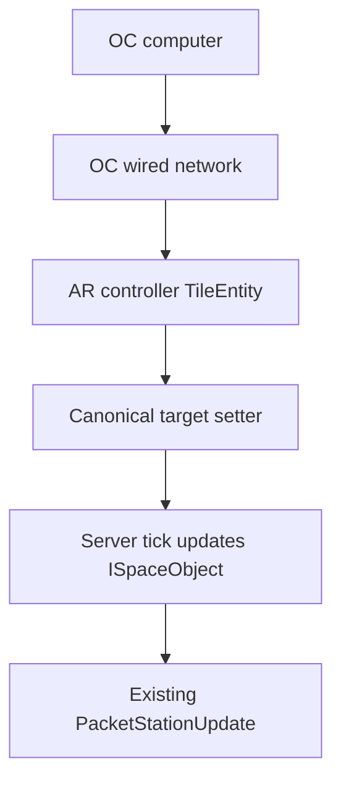

# AdvancedRocketry 1.7.10 OpenComputers 控制器集成规格

- 状态：Implementation-ready
- 目标分支：`MC1.7`
- 规格分支：`agent/opencomputers-integration-spec`
- 审查基线：`9037ffe4a3a4d0bad444fc9c614cb17485c7749e`
- 目标运行时：Minecraft 1.7.10、Forge `10.13.4.1614`、Java 8
- 目标 OpenComputers：`1.12.44-GTNH`（mod id `OpenComputers`）

## 1. 执行摘要

本规格为以下三个现有空间站控制器增加原生 OpenComputers 组件：

| AR 控制器 | OC 组件名 | 控制对象 |
|---|---|---|
| Altitude Controller | `altitude_controller` | 目标轨道高度与最大高度变化速率 |
| Orientation Controller | `orientation_controller` | 与现有 GUI 完全相同的 X/Y 两轴目标角速度 |
| Gravity Controller | `gravity_controller` | 空间站目标重力倍率 |

集成必须修改控制器的目标值，不得绕过控制器直接瞬移
`ISpaceObject` 的实际状态。现有每 tick 渐进逼近、NBT 持久化与
`PacketStationUpdate` 客户端同步仍是唯一权威路径。

OpenComputers 是纯可选依赖。未安装 OpenComputers 时，AdvancedRocketry
必须可以正常编译产物、启动 dedicated server、载入旧世界、放置及操作三个
控制器，且不得出现 `NoClassDefFoundError`、mixin/coremod 早期链接失败或缺失
mod 提示。

Orientation Controller 只暴露两轴：

- `yaw` 对应现有 GUI 的 Y 轴、`ForgeDirection.UP`；
- `pitch` 对应现有 GUI 的 X 轴、`ForgeDirection.EAST`；
- `ForgeDirection.NORTH` 是隐藏的第三轴，本集成不得提供 `roll` callback，
  也不得修改该轴。

## 2. 审查范围与来源

| 来源 | 基线 | 用途 |
|---|---|---|
| `zerozaki666/AdvancedRocketry-Continuation` | `MC1.7@9037ffe` | 实际控制器、空间站状态、NBT 与网络实现 |
| `zerozaki666/libVulpes-Continuation` | `unstable1_7@31b99a8` | `PacketMachine` 与 slider 的真实调用顺序 |
| `GTNewHorizons/OpenComputers` | tag `1.12.44-GTNH@4b04170` | `SimpleComponent`、`Callback`、`Arguments` API 契约 |
| 整合包 `loadedmod.csv` | 2026-08-03 提供 | 确认 OpenComputers `1.12.44-GTNH` 与 ComputerCraft `1.75` 共存 |
| 先前 OpenComputers 初版方案 | 2026-08-02 | 产品方向、组件名与 callback 名称 |

主要审查文件：

- `src/main/java/zmaster587/advancedRocketry/tile/station/TileStationAltitudeController.java`
- `src/main/java/zmaster587/advancedRocketry/tile/station/TileStationOrientationControl.java`
- `src/main/java/zmaster587/advancedRocketry/tile/station/TileStationGravityController.java`
- `src/main/java/zmaster587/advancedRocketry/tile/station/StationAltitudeChangeRate.java`
- `src/main/java/zmaster587/advancedRocketry/stations/SpaceObject.java`
- `src/main/java/zmaster587/advancedRocketry/stations/SpaceObjectManager.java`
- `src/main/java/zmaster587/advancedRocketry/network/PacketStationUpdate.java`
- `src/main/java/zmaster587/advancedRocketry/api/stations/ISpaceObject.java`
- `src/main/java/zmaster587/advancedRocketry/dimension/DimensionProperties.java`
- `src/main/java/zmaster587/advancedRocketry/integration/CompatibilityMgr.java`
- `src/main/java/zmaster587/advancedRocketry/AdvancedRocketry.java`
- `build.gradle`

## 3. 初版方案审查与修正

| 初版内容 | 源码审查结论 | 本规格处理 |
|---|---|---|
| 文档放入 `docs/` | 仓库统一目录是 `doc/` | 使用 `doc/OPENCOMPUTERS_INTEGRATION_SPEC.md` |
| 高度使用 blocks | GUI 明确显示 `gravity * 200 + 100` km | 所有公开高度统一使用 km |
| Altitude API 只控制目标高度 | 当前控制器另有 `1.0x–10.0x`、0.5x 步进的速率 slider | 增加变化速率 getter/setter |
| yaw 是 `0–359°`、pitch 是 `-90–90°` 的绝对角 | 控制器设置的是每小时旋转圈数，不是绝对姿态 | 保留 callback 名称，但参数语义改为 rotations/hour |
| Orientation 有 yaw/pitch/roll 三轴 | GUI 只显示 X/Y，用户要求同 GUI 两轴 | 仅暴露 yaw(Y/UP) 与 pitch(X/EAST)，不暴露 roll |
| `getRotation()` 可直接作为角度 | 实际 renderer 将其再乘 `360`；该内部量是 cycles | API 输出角度时必须 `cycles * 360` 并归一化 |
| 重力可设为 `0.0–2.0` | GUI 仅支持 `0.10–1.00`，步进 0.01；0 还是旧存档默认哨兵 | API 范围严格对齐 `0.10–1.00` |
| 通过 provider/peripheral 和 16-block 调用距离检查 | OC 原生 block component 以有线组件网络决定可达性；callback 没有可靠调用者方块坐标 | 使用 `SimpleComponent`；删除人为 16 格限制 |
| setter 可直接修改 `ISpaceObject` | 会绕过原有加速度、GUI 目标、NBT 和同步 | setter 只修改 TileEntity 的规范化目标值 |
| callbacks 可作为 direct getter | 世界、TileEntity、OC Network 均不保证跨线程安全 | 所有 callbacks 保持 `direct = false` |
| 第一版同时扩展 rocket/station API | 当前需求只覆盖三个控制器 | rocket、warp、导航与整站远程 API 明确延期 |

## 4. 产品目标与非目标

### 4.1 必须达到

- OC 电脑能通过有线组件网络发现并调用三个控制器；
- GUI 与 OC 使用同一套目标值、范围、离散步进、持久化和同步逻辑；
- OC setter 后立即读取目标值，必须得到量化后的有效值；
- 实际高度、姿态和重力继续由服务器 tick 逐步逼近目标；
- 同一控制器被 GUI 与 OC 交替修改时，以服务器最后接受的写入为准；
- 错误参数不能造成 NaN、Infinity、数组越界、负步长或无效 NBT；
- 控制器不在有效空间站上时，callback 返回可处理的 soft error；
- 组件不能通过参数指定其他空间站 ID 或任意世界坐标；
- OpenComputers 缺失时完全保持现有行为；
- OpenComputers 存在时也不要求修改 LibVulpes；
- dedicated server 不加载任何 client-only 类。

### 4.2 明确不做

- 不实现 ComputerCraft peripheral；整合包虽有 ComputerCraft `1.75`，但它不在本轮范围；
- 不通过 OpenPeripheral 自动包装 AR TileEntity；
- 不增加 `roll`、Z/NORTH callback；
- 不把现有两轴角速度控制器改造成绝对姿态控制器；
- 不扩大 GUI 允许的高度、角速度、重力或速率范围；
- 不允许 OC 绕过控制器的渐进变化速度；
- 不增加无线、跨维度或按 station id 控制；
- 不实现 owner、team、claim 或新的 ACL 系统；
- MVP 不发送 OC signal/event，脚本使用 getter/status 轮询；
- 不在 AdvancedRocketry jar 中打包 OpenComputers API 类；
- 不将 OpenComputers 变为 FML required dependency；
- 不在本轮扩展火箭、warp controller、navigation computer、docking port 或整站管理 API。

## 5. 当前控制器真实数据模型

### 5.1 Altitude Controller

TileEntity：`TileStationAltitudeController`

| 概念 | 当前字段/公式 | 有效范围 |
|---|---|---|
| 目标内部轨道距离 | `gravity = progress + 10` | `10–200` |
| 目标显示高度 | `gravity * 200 + 100` km | `2100–40100 km` |
| 当前显示高度 | `orbitalDistance * 200 + 100` km | 运行时 double |
| 高度 slider progress | `progress` | `0–190` |
| 速率 slider progress | `altitudeChangeRateProgress` | `0–18` |
| 速率倍率 | `1.0 + 0.5 * progress` | `1.0x–10.0x` |

服务器每 tick 通过 `StationAltitudeChangeRate.moveTowards(...)` 改变
`ISpaceObject.orbitalDistance`，随后发送
`PacketStationUpdate.Type.ALTITUDE_UPDATE`。OC 必须设置目标 slider，不能直接
调用 `setOrbitalDistance()`。

### 5.2 Orientation Controller

TileEntity：`TileStationOrientationControl`

现有 GUI 只有两条 slider，但数据数组仍有三项：

| GUI/API 语义 | 数组 index | `ForgeDirection` | 目标单位 | 范围 |
|---|---:|---|---|---:|
| pitch / X | 0 | `EAST` | rotations/hour | `-60–60` |
| yaw / Y | 1 | `UP` | rotations/hour | `-60–60` |
| hidden roll / Z | 2 | `NORTH` | rotations/hour | 不暴露 |

内部角速度为 cycles/tick：

```text
deltaRotation = targetRotationsPerHour / 72000
currentRotationsPerHour = deltaRotation * 72000
displayAngleDegrees = normalize(getRotation(axis) * 360)
```

`ISpaceObject#getRotation` 的注释称返回 degree，但实际 station renderer 将其乘以
`360` 后传给 OpenGL。OpenComputers 层不得把 raw cycles 误报为 degree。

服务器每 tick 以 `getMaxRotationalAcceleration()` 逼近目标，并通过
`PacketStationUpdate.Type.ROTANGLE_UPDATE` 同步。OC 只设置
`numRotationsPerHour[0/1]` 对应目标。

### 5.3 Gravity Controller

TileEntity：`TileStationGravityController`

| 概念 | 当前字段/公式 | 有效范围 |
|---|---|---|
| 目标整数百分比 | `gravity = progress + 10` | `10–100` |
| 目标重力倍率 | `gravity / 100.0` | `0.10–1.00` |
| slider progress | `progress` | `0–90` |
| 实际重力倍率 | `properties.getGravitationalMultiplier()` | 运行时 float |
| 每 tick 最大变化 | `0.001` | 固定 |

服务器通过 `DimensionProperties#setGravitationalMultiplier` 渐进改变实际值，并发送
`PacketStationUpdate.Type.DIM_PROPERTY_UPDATE`。OC setter 只写目标百分比。

### 5.4 空间站解析

三个控制器当前都只在 `WorldProviderStation` 中工作，并使用自身方块坐标：

```java
SpaceObjectManager.getSpaceManager()
        .getSpaceStationFromBlockCoords(xCoord, zCoord);
```

OC callback 必须复用同一解析方式。不得接受 `stationId`、dimension id、x/z 或玩家
坐标作为参数，也不得缓存 `ISpaceObject` 跨越 chunk unload、空间站重载或世界切换。

## 6. 实现前置修复

这些问题已经存在于当前源码。若不先修复，GUI、NBT 与 OC 会得到彼此不一致的目标
状态，因此纳入本集成的必做范围。

### 6.1 Orientation NBT 轴读取错误

当前 `readFromNBT` 对 X/Y/Z 三项全部读取 `numRotationsX`。必须改为：

```java
numRotationsPerHour[0] = nbt.getShort("numRotationsX");
numRotationsPerHour[1] = nbt.getShort("numRotationsY");
numRotationsPerHour[2] = nbt.getShort("numRotationsZ");
```

读取后必须逐轴 clamp 到 `-60–60`，再推导 slider progress。旧世界键名保持不变。

### 6.2 Gravity/Orientation PacketMachine 应用位置

LibVulpes 的 `PacketMachine` 约定是：

1. `readDataFromNetwork(...)` 只把字节读入临时 `NBTTagCompound`；
2. `useNetworkData(...)` 在目标 side 执行实际状态修改。

当前 Gravity 与 Orientation 在 `readDataFromNetwork` 中直接修改 TileEntity，且
`useNetworkData` 为空。必须按 Altitude Controller 的方式改为 server-side apply，并
在成功变更后 `markDirty()`。该修复可让 GUI 与 OC 共用同一个规范化 setter。

### 6.3 统一规范化 setter

三个控制器分别新增不依赖 OC 类型的 server-side 方法。GUI network handler 与 OC
callback 必须都调用它们，不能各写一套范围换算。

推荐职责：

```java
// Names are illustrative; final implementation may keep package-private names.
int setTargetAltitudeProgress(int progress);
int setAltitudeChangeRateProgress(int progress);
int setTargetRotationRate(int axis, int rotationsPerHour);
int setTargetGravityPercent(int percent);
```

每个方法必须：

- clamp 到现有 GUI 合法范围；
- 只在值变化时写字段并 `markDirty()`；
- 返回最终生效值；
- 不直接修改 `ISpaceObject` 的实际状态；
- 不发送 client-to-server `PacketMachine`；OC callback 本来就在服务器执行；
- 允许 GUI network path 继续使用现有 packet id 和 NBT key。

### 6.4 TileEntity 目标状态同步

Altitude 与 Gravity 当前 `getDescriptionPacket()` 构造了
`S35PacketUpdateTileEntity`，但返回 `super.getDescriptionPacket()`；Altitude 所构造的
NBT 还只包含 `gravity`，遗漏 `altitudeChangeRateProgress`。Orientation 没有等价的
目标状态描述包。

实现时为三个 controller 建立完整、对称的 target-state sync：

| 控制器 | description NBT 必须包含 |
|---|---|
| Altitude | `gravity`、`altitudeChangeRateProgress` |
| Orientation | `numRotationsX`、`numRotationsY`、`numRotationsZ` |
| Gravity | `gravity` |

`getDescriptionPacket()` 必须返回实际构造的 packet，`onDataPacket()` 必须只更新
客户端 target/progress；server canonical setter 在目标发生变化后调用
`worldObj.markBlockForUpdate(xCoord, yCoord, zCoord)`。也可用一个等价的显式
server-to-client `PacketMachine` 方案，但同一项目内只能选择一种目标同步协议。

目标是：OC 修改后重新打开 GUI，或客户端收到方块更新时，看到服务器接受的目标值；
不得只同步实际 `ISpaceObject` 状态而让 controller slider 保持旧值。

## 7. OpenComputers 集成架构

### 7.1 选择 `SimpleComponent`

三个 TileEntity 直接实现 `li.cil.oc.api.network.SimpleComponent`，使用
`@Callback` 暴露方法。OpenComputers `1.12.44-GTNH` 的官方 API 明确支持通过
Forge `@Optional.Interface`/`@Optional.Method` 去除硬依赖。

不使用外部 `DriverSidedTileEntity`，原因是 driver 只会让 OC Adapter 为相邻方块
创建 `ManagedEnvironment`，会强制玩家使用 Adapter，而三个 AR 控制器本身适合作为
原生有线组件。也不新增“16 格扫描 provider”；网络连通性由 OC cable/component
network 自然决定。



### 7.2 可选依赖隔离

每个控制器类采用官方模式：

```java
@Optional.Interface(
        iface = "li.cil.oc.api.network.SimpleComponent",
        modid = "OpenComputers")
public class TileStationAltitudeController extends TileEntity
        implements IModularInventory, INetworkMachine, ISliderBar,
        SimpleComponent {

    @Override
    @Optional.Method(modid = "OpenComputers")
    public String getComponentName() {
        return "altitude_controller";
    }

    @Callback(doc = "...")
    @Optional.Method(modid = "OpenComputers")
    public Object[] getCurrentAltitude(Context context, Arguments args) {
        // callback body
    }
}
```

强制规则：

- `SimpleComponent` 接口使用 `@Optional.Interface`；
- `getComponentName` 和每一个参数/返回值引用 OC 类型的方法都使用
  `@Optional.Method`；
- 不让 OC 类型出现在字段、静态初始化器、构造器、父类或通用 helper 的签名中；
- 不在 `AdvancedRocketry` 主类静态字段中引用任何 OC class literal；
- 所有 callback 均使用默认 `direct = false`；
- 不手写 `Node`、`Environment`、`save/load node` 或网络 join 生命周期；这些由
  `SimpleComponent` transformer 负责；
- 三个核心 controller 在无 OC 环境的启动测试中必须被实际注册与实例化。

### 7.3 构建依赖

在 GTNH Maven repository 中以 API classifier 添加 compile-only 依赖：

```groovy
repositories {
    maven {
        name = 'gtnh-releases'
        url = uri('https://nexus.gtnewhorizons.com/repository/releases/')
    }
}

dependencies {
    compileOnly('com.github.GTNewHorizons:OpenComputers:1.12.44-GTNH:api') {
        transitive = false
    }
    testRuntimeOnly('com.github.GTNewHorizons:OpenComputers:1.12.44-GTNH:api') {
        transitive = false
    }
}
```

若该确切版本的 `api` classifier 在 CI 镜像暂不可用，可临时改用同版本 `dev`
classifier，仍必须是 `compileOnly`、`transitive = false`，不得把 OC 类打入 AR jar。
本地 `libs/OpenComputers-*-dev.jar` 只能作为与当前 Galacticraft 依赖相同风格的
fallback，不能成为 CI 唯一来源。

`@Mod.dependencies` 可加入可选排序 `after:OpenComputers`，不得加入
`required-after:OpenComputers`。`CompatibilityMgr` 可记录
`Loader.isModLoaded("OpenComputers")` 用于一次性日志与诊断，但 callback 能否存在
由 `@Optional`/OC transformer 决定，不得用反射调用 OC API。

### 7.4 文件落点

预计修改：

- `build.gradle`
- `src/main/java/zmaster587/advancedRocketry/AdvancedRocketry.java`
- `src/main/java/zmaster587/advancedRocketry/integration/CompatibilityMgr.java`
- `src/main/java/zmaster587/advancedRocketry/tile/station/TileStationAltitudeController.java`
- `src/main/java/zmaster587/advancedRocketry/tile/station/TileStationOrientationControl.java`
- `src/main/java/zmaster587/advancedRocketry/tile/station/TileStationGravityController.java`

推荐新增：

- `src/main/java/zmaster587/advancedRocketry/integration/opencomputers/OpenComputersValueCodec.java`
- `src/test/java/zmaster587/advancedRocketry/integration/opencomputers/OpenComputersValueCodecTest.java`

`OpenComputersValueCodec` 必须是纯 Java 8 数值转换/验证 helper，不 import OC、Minecraft
或 Forge 类型，便于单元测试且保证无 OC 环境可加载。

## 8. 共享 callback 契约

### 8.1 服务端权威

OpenComputers 非 direct callback 在服务器线程调度。每个 callback 开头都必须验证：

1. `worldObj != null`；
2. `!worldObj.isRemote`；
3. provider 是 `WorldProviderStation`；
4. 当前 x/z 能解析到非 null `ISpaceObject`；
5. TileEntity 尚未 invalid，所在 chunk 仍加载。

不得从 callback 调用 `PacketHandler.sendToServer`。setter 只更新 TileEntity 目标；后续
实际状态同步继续使用三个 controller 已有的 `PacketStationUpdate` 类型。

### 8.2 参数验证与量化

- 使用 `Arguments.checkDouble(0)` 或 `checkInteger(0)` 处理 Lua 参数；
- 错误类型/缺失参数让 OC 按 caller error 抛出标准异常；
- 所有 double 先拒绝 `NaN` 与正负 Infinity；
- 超出 GUI 合法范围返回 soft error，不静默 clamp；
- 合法范围内但不落在 GUI 离散步进上的数值，量化到最近的合法值；
- 正好位于两个离散值中点时，向数值更大的值量化；
- setter 成功时返回量化后的有效值，脚本不能假定输入值原样保存。

### 8.3 返回与错误格式

Mutator 成功：

```text
true, effectiveValue
```

Mutator soft error：

```text
false, errorCode, message
```

Getter/status soft error：

```text
nil, errorCode, message
```

固定 error code：

| code | 含义 |
|---|---|
| `not_server` | callback 意外落在客户端上下文 |
| `invalid_tile` | TileEntity/world/chunk 已失效 |
| `not_on_station` | 不在 station provider 或无法解析所属空间站 |
| `not_finite` | 数值为 NaN/Infinity |
| `out_of_range` | 超出对应 GUI 范围 |

错误 message 用稳定的英文短句，error code 才是脚本判断依据。不得把本地化 GUI 文本
作为 API 错误协议。

### 8.4 OC 网络是访问边界

组件只能由能看到其 OC component node 的电脑调用。MVP 不增加 16-block 检查，原因：

- 有线网络可合法跨越 16 格；
- `Context` 不提供可靠的调用电脑世界坐标；
- 一个网络可有多个电脑，按“最近电脑”判定不确定；
- callback 不允许传入 station id，因此无法越权选择另一空间站；
- AR 三个控制器本身也没有玩家 owner/claim 语义。

如未来引入权限系统，应基于 component address、OC network 与 AR/claim ownership 设计，
不得重新加入距离 heuristic。

## 9. `altitude_controller` API

### 9.1 组件名

```lua
component.list("altitude_controller")
```

### 9.2 Callback 表

| Callback | 参数 | 成功返回 | 语义 |
|---|---|---|---|
| `setTargetAltitude` | `targetKm:number` | `true, effectiveKm` | 设置目标显示高度 |
| `getTargetAltitude` | 无 | `targetKm` | 读取已保存的目标高度 |
| `getCurrentAltitude` | 无 | `currentKm` | 读取空间站实际高度 |
| `setChangeRateMultiplier` | `multiplier:number` | `true, effectiveMultiplier` | 设置现有速率 slider |
| `getChangeRateMultiplier` | 无 | `multiplier` | 读取 `1.0x–10.0x` 目标倍率 |
| `getStatus` | 无 | `table` | 返回组合状态 |

所有高度单位都是 km，不是 blocks、slider progress 或 raw orbital distance。

### 9.3 高度换算

输入合法范围：`2100–40100 km`。量化步进：`200 km`。

```text
gravity = clamp(round((targetKm - 100) / 200), 10, 200)
effectiveKm = gravity * 200 + 100
progress = gravity - 10
```

先验证输入在闭区间内，再量化。不能让 `40101` 被 clamp 为 `40100` 后静默成功。

当前高度：

```text
currentKm = spaceObject.getOrbitalDistance() * 200 + 100
```

getter 不量化当前高度；它在移动期间应返回 double。

### 9.4 速率换算

输入合法范围：`1.0–10.0`。量化步进：`0.5`。

```text
progress = clamp(round((multiplier - 1.0) / 0.5), 0, 18)
effectiveMultiplier = 1.0 + 0.5 * progress
```

必须复用 `StationAltitudeChangeRate` 的常量/方法，避免 OC 与 GUI 两套 magic number。

### 9.5 `getStatus` 返回表

```lua
{
  stationId = 3,
  state = "ascending", -- "idle", "ascending", "descending"
  currentAltitude = 8200.35,
  targetAltitude = 10100,
  changeRateMultiplier = 2.5
}
```

状态基于服务器当前值与目标值计算：

- 差值绝对值不大于 `0.01 km`：`idle`；
- 当前值小于目标：`ascending`；
- 当前值大于目标：`descending`。

### 9.6 Callback doc strings

每个 `@Callback` 提供 OC 可识别格式的英文 doc，例如：

```text
function(targetKm:number):boolean, number|string -- Sets the target station altitude in km; valid range 2100..40100, quantized to 200 km.
```

## 10. `orientation_controller` API

### 10.1 两轴契约

本组件只控制角速度：

| API 名称 | 现有 GUI | 内部 axis | 含义 |
|---|---|---|---|
| `yaw` | Y slider | index 1 / `UP` | 绕空间站 Y 轴旋转速度 |
| `pitch` | X slider | index 0 / `EAST` | 绕空间站 X 轴旋转速度 |

参数和 target getter 单位均为 rotations/hour。有效范围均为整数 `-60–60`。
合法小数输入量化到最近整数；超出范围返回 `out_of_range`。

### 10.2 Callback 表

| Callback | 参数 | 成功返回 | 语义 |
|---|---|---|---|
| `setYaw` | `rotationsPerHour:number` | `true, effectiveRate` | 设置 Y/UP 轴目标角速度 |
| `getYaw` | 无 | `targetRate` | 读取 Y/UP 轴目标角速度 |
| `setPitch` | `rotationsPerHour:number` | `true, effectiveRate` | 设置 X/EAST 轴目标角速度 |
| `getPitch` | 无 | `targetRate` | 读取 X/EAST 轴目标角速度 |
| `getOrientation` | 无 | `table` | 读取两轴实际角度、实际速率和目标速率 |

不得增加 `setRoll`、`getRoll`，`getOrientation` 也不得包含或修改隐藏 Z/NORTH
目标。集成前置 NBT 修复仍需正确保存/读取第三轴，以免旧世界数据被 X 轴覆盖。

### 10.3 `getOrientation` 返回表

```lua
{
  yaw = 172.5,            -- degrees, normalized to [0, 360)
  pitch = 14.0,           -- degrees, normalized to [0, 360)
  yawRate = 3.25,         -- current rotations/hour
  pitchRate = -1.5,       -- current rotations/hour
  targetYawRate = 4,      -- controller target rotations/hour
  targetPitchRate = -2
}
```

换算：

```text
angleDegrees = floorModEquivalent(getRotation(axis) * 360, 360)
ratePerHour = getDeltaRotation(axis) * 72000
```

Java double 的 `%` 对负数仍可为负，因此归一化使用：

```java
((degrees % 360.0D) + 360.0D) % 360.0D
```

`getYaw()`/`getPitch()` 保持先前约定的 callback 名称，但返回 controller target
rate，不返回绝对角；绝对角只由 `getOrientation()` 提供。

## 11. `gravity_controller` API

### 11.1 Callback 表

| Callback | 参数 | 成功返回 | 语义 |
|---|---|---|---|
| `setGravityMultiplier` | `multiplier:number` | `true, effectiveMultiplier` | 设置目标重力倍率 |
| `getGravityMultiplier` | 无 | `currentMultiplier, targetMultiplier` | 同时读取实际值与目标值 |

输入合法范围：`0.10–1.00`。量化步进：`0.01`。

```text
targetPercent = clamp(round(multiplier * 100), 10, 100)
effectiveMultiplier = targetPercent / 100.0
progress = targetPercent - 10
```

`getGravityMultiplier()` 的第一个值来自空间站
`DimensionProperties#getGravitationalMultiplier()`，第二个值来自 controller target。
返回两个值可让脚本判断渐进变化是否完成，同时保留先前约定的方法名。

不得把 `0.0` 解释为关闭重力。当前代码把 `gravity == 0` 当作旧状态哨兵并改成
`15`，因此 OC 必须在写入前拒绝 `0.0`，也不得扩大到 `2.0`。

## 12. 持久化、同步与一致性

### 12.1 NBT 兼容

保留全部既有 key：

| 控制器 | 既有 key |
|---|---|
| Altitude | `numRotations`, `altitudeChangeRateProgress` |
| Orientation | `numRotationsX`, `numRotationsY`, `numRotationsZ` |
| Gravity | `numRotations` |

不增加 OC 专用目标 NBT；OC 与 GUI 共享现有字段。读取旧世界时先按既有默认语义读取，
再 clamp/推导 progress。不得因缺少新 key 改变旧控制器目标。

`SimpleComponent` 的 node/address 生命周期由 OC transformer 注入管理，不在 AR
controller NBT 中复制 node 数据。

### 12.2 GUI 与 OC 最终一致

目标值改变后：

- server TileEntity 立即保存 canonical target；
- `markDirty()` 保证 chunk save；
- 目标发生变化时 `worldObj.markBlockForUpdate(x, y, z)` 触发第 6.4 节的完整
  target-state description sync；
- 实际 `ISpaceObject` 状态继续由 tick 更新；
- 现有 `PacketStationUpdate` 继续同步实际状态；
- 不因 OC 写入额外广播全量 station packet；
- 不在值未变化时重复 mark/broadcast。

### 12.3 Chunk/world 生命周期

- callback 每次重新解析 station，不缓存跨 tick 的 `ISpaceObject`；
- controller chunk 卸载后 OC node 由 OC 生命周期移除；
- 重载后 component address 应保持稳定；
- TileEntity invalid 后 callback 不再修改任何状态；
- 服务器关闭/世界保存过程中不得启动异步任务。

## 13. 日志与诊断

启动时最多输出一次：

```text
OpenComputers 1.12.44-GTNH detected; station controller integration enabled
```

OC 缺失时使用 debug/info 级别的一次性日志即可，不得 warning/error。每次脚本参数错误、
`not_on_station` 或轮询失败都不得刷 server log；soft error 只返回调用者。

真正的异常（例如 callback 捕获到不符合源码契约的数组长度）记录 component 名、维度与
controller 坐标，但不得记录 OC 用户程序内容。

## 14. Lua 使用示例

### 14.1 Altitude

```lua
local component = require("component")
local altitude = component.altitude_controller

local ok, appliedOrCode, message = altitude.setTargetAltitude(10100)
if not ok then
  error(appliedOrCode .. ": " .. message)
end

altitude.setChangeRateMultiplier(2.5)

while true do
  local status, code, reason = altitude.getStatus()
  if not status then error(code .. ": " .. reason) end
  print(status.state, status.currentAltitude, status.targetAltitude)
  if status.state == "idle" then break end
  os.sleep(1)
end
```

### 14.2 Orientation

```lua
local component = require("component")
local orientation = component.orientation_controller

assert(orientation.setYaw(4))
assert(orientation.setPitch(-2))

local state = orientation.getOrientation()
print("yaw deg", state.yaw, "yaw rph", state.yawRate)
print("pitch deg", state.pitch, "pitch rph", state.pitchRate)
```

### 14.3 Gravity

```lua
local component = require("component")
local gravity = component.gravity_controller

local ok, applied = gravity.setGravityMultiplier(0.38)
assert(ok, applied)

local current, target = gravity.getGravityMultiplier()
print("gravity", current, "target", target)
```

若一个网络中有多个同名控制器，脚本必须通过 `component.list(name)` 获得地址并使用
`component.proxy(address)`，不能依赖 `component.altitude_controller` 的选择顺序。

## 15. 测试计划

### 15.1 纯单元测试

`OpenComputersValueCodecTest` 至少覆盖：

- 高度最小/最大值：`2100`、`40100`；
- 高度 200 km 离散点与 midpoint 向上量化；
- `2100` 以下、`40100` 以上、NaN、Infinity 拒绝；
- 速率 `1.0`、`10.0`、0.5 步进与越界拒绝；
- yaw/pitch `-60`、`0`、`60` 与小数 midpoint；
- gravity `0.10`、`1.00`、0.01 步进与 `0.0`/`2.0` 拒绝；
- cycles 到 degrees 的正值、负值和跨 360° 归一化；
- cycles/tick 与 rotations/hour 的 72000 换算；
- 所有转换 round-trip 回到 GUI progress 后完全一致。

### 15.2 Controller 回归测试

- Orientation NBT X/Y/Z 分别 round-trip，不能再全部恢复为 X；
- GUI packet 与 OC setter 走同一 canonical setter；
- Gravity/Orientation `readDataFromNetwork` 不提前修改状态；
- `useNetworkData(..., Side.SERVER, ...)` 应用、clamp 并 mark dirty；
- Altitude/Gravity description packet 返回有效 packet；
- 不在 station provider 时三个 controller 均不修改世界状态；
- hidden NORTH 轴在任意 yaw/pitch callback 后保持原值；
- 重复设置相同目标不产生多余 dirty/update。

### 15.3 启动矩阵

| 场景 | 预期 |
|---|---|
| client + server，无 OpenComputers | 正常启动，无缺类，无 required-mod 提示 |
| dedicated server + OpenComputers `1.12.44-GTNH` | 正常注册三个组件，无 client class load |
| client + OC + 当前整合包 | 与 GTNHLib、Angelica、ComputerCraft、OpenPeripheral 共存 |
| 旧世界升级、无 OC | 三个 controller 目标与行为保持 |
| 旧世界升级、有 OC | 旧 controller 可被 cable 发现，NBT 目标保持 |

构建后检查 universal jar：不得包含 `li/cil/oc/**`。

### 15.4 游戏内集成验收

每个控制器分别执行：

1. 放置于真实空间站，并接入 OC cable/computer；
2. `component.list()` 只能看到预期组件名；
3. getter 与 GUI 初始值一致；
4. OC setter 后 GUI 目标值与 slider 位置更新；
5. 实际状态按原速度或选定倍率渐进变化，不瞬移；
6. chunk unload/reload 后目标和 component address 保持；
7. 服务器重启后目标保持；
8. 拆除 cable 后组件不可达；重新连接后恢复；
9. 两个同名组件在同一网络时可通过 address 独立控制；
10. 错误参数返回规定 error code，不崩服、不刷日志。

Orientation 额外验证：

- yaw 只改变 Y/UP；
- pitch 只改变 X/EAST；
- 隐藏 Z/NORTH 在 OC 控制前后完全相同；
- `getOrientation()` 角度是 degree，速率是 rotations/hour。

## 16. 实施阶段

### Phase 0：前置一致性修复

- 修复 Orientation Y/Z NBT 读取；
- 修复 Gravity/Orientation `PacketMachine` apply path；
- 修复 Altitude/Gravity target description sync；
- 抽取 canonical setters 与纯数值 codec；
- 添加不依赖 OC runtime 的回归测试。

### Phase 1：Altitude 原生组件

- 加入 compile-only OC API；
- 完成 `altitude_controller` 六个 callbacks；
- 验证高度及新速率 slider 与 GUI/NBT 一致；
- 完成有/无 OC 启动测试。

### Phase 2：Orientation 与 Gravity 原生组件

- 完成 `orientation_controller` 两轴 callbacks；
- 完成 `gravity_controller` callbacks；
- 验证 packet、restart、chunk reload 与多组件 address；
- 完成整合包 smoke test。

### Phase 3：可选后续能力，不阻塞本规格验收

- 目标改变/到达事件 signal；
- ComputerCraft 原生 peripheral；
- rocket、warp、navigation 与 docking API；
- 若未来存在明确需求，再设计 owner/claim 权限层。

Phase 3 不得在实现 Phase 0–2 时预留未经验证的跨维度万能控制接口。

## 17. 验收标准

同时满足以下条件才算实现完成：

- 三个组件名和 callback 签名与本规格一致；
- Orientation 只有 yaw/pitch 两轴，无 roll；
- 高度、角速度、重力、速率单位和范围与当前 GUI 源码一致；
- GUI、OC、NBT 共享 canonical target setters；
- OC setter 不直接改变实际 `ISpaceObject` 状态；
- 所有 callbacks 为 server-thread、non-direct；
- 无 16-block heuristic，无 station-id 远程选择；
- 有/无 OC 两种 dedicated server 均能启动；
- 旧世界 NBT 兼容，Orientation 三轴读取缺陷已修复；
- `./gradlew test` 与 `./gradlew build` 通过；
- universal jar 不含 OpenComputers API 类；
- 游戏内 Lua 示例可运行，并通过完整集成验收矩阵。

## 18. 参考链接

- [OpenComputers `1.12.44-GTNH` source](https://github.com/GTNewHorizons/OpenComputers/tree/1.12.44-GTNH)
- [SimpleComponent API](https://github.com/GTNewHorizons/OpenComputers/blob/1.12.44-GTNH/src/main/java/li/cil/oc/api/network/SimpleComponent.java)
- [Callback API](https://github.com/GTNewHorizons/OpenComputers/blob/1.12.44-GTNH/src/main/java/li/cil/oc/api/machine/Callback.java)
- [Arguments API](https://github.com/GTNewHorizons/OpenComputers/blob/1.12.44-GTNH/src/main/java/li/cil/oc/api/machine/Arguments.java)
- [OpenComputers component visibility](https://github.com/GTNewHorizons/OpenComputers/blob/1.12.44-GTNH/src/main/java/li/cil/oc/api/network/Visibility.java)
