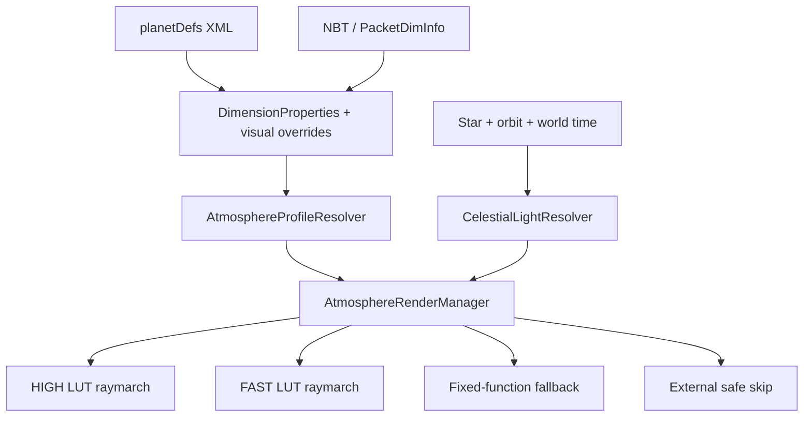

# AdvancedRocketry 1.7.10 写实大气渲染提升实施规格

状态：Implementation-ready  
目标分支：`MC1.7`  
规格分支：`codex/realistic-atmosphere-rendering-spec`  
审查基线：`919f5ca7f4c5c1eda9dc2481b04b9f85beca764f`  
目标运行时：Minecraft 1.7.10、Forge `10.13.4.1614`、Java 8、LWJGL 2、OpenGL compatibility profile

## 1. 执行摘要

当前大气不是体积散射，而是若干静态贴图和透明几何的叠加。空间站下方的行星尤其明显：一张 `atmosphereleo.png` 外加五个固定透明度同心球壳，直接形成肉眼可见的灰色分层环；这不是提高贴图分辨率能够解决的问题。

本规格要求用同一套、由 `planetDefs` 与恒星数据驱动的视觉模型，替换以下两类效果：

1. **空间视角大气层**：连续的球壳光程、受光侧辉光、夜侧衰减、晨昏线和切线方向增厚；
2. **地表/近地平线天空**：天顶与地平线的连续散射、日出日落暖色带、高度升高后的稀薄化，以及与星光方向一致的昼夜变化。

正式 shader 路径使用 GLSL 1.20 的 bounded single-scattering approximation：

- 沿视线做固定步数 raymarch；
- Rayleigh、Mie 与可选 absorption 分量分别计算；
- 使用 CPU 预计算的二维 optical-depth LUT 查询样本到恒星的柱密度，避免“每个视线样本再沿恒星方向 raymarch”的昂贵嵌套积分；
- 使用解析 ray/sphere 求交和地表遮挡形成自然的 limb、terminator 与 sunset；
- 不需要 scene-color copy、depth texture、compute shader、3D texture 或现代 OpenGL。

OpenGL 2.0、shader 编译或 LUT 上传不可用且当前没有外部 shader program 时，必须自动降级到单层连续渐变的 fixed-function renderer。若未知外部 shader program 已绑定，则 fixed-function fragment stage 本身不会生效；此时进入 `EXTERNAL_SAFE_SKIP`，不接管 program、不绘制 molecular atmosphere pass。两种降级都不能黑屏、泄漏 GL 状态、让无大气行星产生光晕，或重新出现五条离散同心带。

本项目是视觉升级，不改变：

- `atmosphereDensity` 的玩法单位、范围和 AtmosphereTypes 压力分档；
- `hasOxygen`、气压伤害、温度、terraforming、降雨、矿物/生物群系判定；
- gas giant 的不可着陆语义；
- Forge dimension、火箭和空间站导航行为；
- 第三方 `IDimensionProperties` 实现的 ABI。

## 2. 审查范围与现状

### 2.1 主要调用入口

| 场景 | 当前入口 | 当前大气实现 |
|---|---|---|
| AR 行星地表 | `WorldProviderPlanet#getSkyRenderer` → `RenderPlanetarySky#render` | Vanilla 风格 sky plane、颜色乘法、sunrise fan |
| Overworld override | `PlanetEventHandler#worldLoadEvent` → `RenderPlanetarySky` | 与 AR 行星共用旧路径 |
| 空间站 | `WorldProviderStation` → legacy alias `RenderSpaceSky` → `RenderStationSpaceSky` | 贴图球 + 五个透明球壳 |
| 行星/月球远景 | `RenderPlanetarySky#renderPlanetPubHelper` | `atmglow.png`、`atmosphere2.png` 与 `shadow.png` 平面 |
| Free-space | `RenderFreeSpaceSky#render` | 普通行星只有 billboard 图标，无 atmosphere/rings/shadow |
| 星图/GUI | `GuiPlanetButton`、`ModulePanetImage` → `renderPlanetPubHelper` | 与远景平面 helper 共用 |
| 3D planetary hologram | `RenderPlanetUIEntity#doRender` | `atmosphere.obj` 重复放大五次 |
| 火箭高空临时轨道 | `RocketEventHandler#onPostWorldRender` | 五个 `AtmosphereGlow` 平面 |

以下 legacy 类型具有兼容价值，不能删除或改名：

- `RenderSpaceSky`
- `WorldProviderSpace`
- `RenderPlanetarySky#renderPlanetPubHelper(...)`
- 现有 `renderPlanet(...)` / `renderPlanet2(...)` 签名

新实现通过新增 overload 和内部 adapter 接入，旧方法继续存在并走安全的兼容路径。

### 2.2 图 1 分层环的直接原因

`RenderStationSpaceSky` 当前行为：

```text
surface sphere
  + atmosphereleo.png sphere（additive，固定白色 alpha）
  + 5 × 无纹理同心 sphere（固定 alpha 0.08）
```

具体问题：

- `atmosphereThickness = min(4, radius * 0.05)`，完全不使用实际气压；
- 五个离散半径的轮廓正是截图中的五条灰带；
- 只接收 `hasAtmosphere` 与 `skyColor`，忽略 density、`fogColor`、恒星颜色和太阳方向；
- 传入 `renderPlanet2` 的光照角度被 station override 忽略；
- 地表、云层和大气都没有 terminator，夜侧仍像自发光；
- gas giant 使用六层硬编码蓝色球壳，再叠固定蓝色 tint；
- cloud texture 与分子散射混在同一概念中，已烘焙云层的 LEO 贴图还可能再次叠云而过曝；
- `Minecraft.getSystemTime()` 驱动动画，暂停或固定 world time 时仍变化，不利于稳定截图与回归测试。

### 2.3 其他已确认问题

`RenderPlanetarySky#renderPlanetPubHelper`：

- `atmGlow.png` 在 `hasAtmosphere` 判断前无条件绘制，因此真空天体也有白色 halo；
- atmosphere 是一张 additive quad，没有球壳光程；
- atmosphere、surface shadow 与 ring shadow 各自独立，光照方向可能不一致。

`RenderPlanetarySky#render`：

- `atmosphereDensity / 100` 可达 `16`，但若干颜色与 alpha 公式仍假定约 `0..2`；
- `(2 - atmosphere) / 2` 在高压行星会变成负值；
- sunrise alpha 在 provider 与 renderer 可能重复乘 density；
- rain 路径又把同一 density 除以 100，单位不统一；
- 星星可见度用 `0.5`、`0.25` 两个分段阈值切换，存在明显跳变。

`DimensionProperties#getAtmosphereDensityAtHeight`：

- `y <= 256` 基本保持全密度；
- `y=256..456` 线性降到 0；
- 它是既有 gameplay/visual heuristic，不是指数尺度高度。

新 renderer 可以把该值作为“相机所在高度的权威稀薄程度”，但不能修改该方法或假装它已经是物理高度。

## 3. 产品目标

### 3.1 必须达到

- 空间站近距离视角看不到离散同心球壳；
- 大气外缘连续、无几何条带；shader 路径提供解析亚像素抗锯齿，fixed-function fallback 至少不产生离散壳层和明显多边形折线；
- 受光侧、背光侧与夜侧亮度明显不同；
- atmosphere terminator 与 surface terminator 使用同一恒星方向；
- 切线视线具有更长光程，limb 比正视行星中心更明显；
- 地表天空在白天具有天顶—地平线渐变；
- 日出日落暖色集中在接近太阳的地平线附近，而不是整片天空统一染橙；
- 高度上升时天空和 halo 连续变薄；
- `planetDefs` 中不同 `skyColor`、`fogColor` 与 density 得到可预测的不同效果；
- terraforming 修改当前 density 后客户端无需重登即可更新；
- 无大气天体绝不绘制 `atmGlow`、shell 或 atmospheric haze；
- gas giant 有更厚的 haze，但仍尊重 planet color；
- shader 失败或 OpenGL 2.0 不可用时可靠走连续 fallback；外部 shader program 活跃时安全跳过本 subsystem 且不破坏外部渲染；
- F3+T、窗口 resize、全屏切换、切维度和 world unload 后不泄漏 program/texture；
- dedicated server 不加载任何 LWJGL 或 client renderer 类；
- 普通玩法数值、存档和网络协议保持兼容。

### 3.2 明确不做

- 不实现科研级完整多重散射；
- 不实现 Bruneton/Hillaire 4D LUT；
- 不实现 compute shader、3D texture、UBO、VAO、MRT 或现代 shader JSON；
- 不做屏幕空间 terrain aerial-perspective 后处理；
- 不读取 scene depth 或对世界几何做 RGB extinction；
- 不实现 volumetric clouds、云影、HDR bloom 或天气系统重写；
- 不保证高级内部 shader 与所有 OptiFine/Angelica shader pack 同时显示；
- 不根据 `<gas>` 列表推断真实气体丰度或化学组成；
- 不把 `hasOxygen` 直接解释成臭氧含量；
- 不改变 `AtmosphereTypes`、压力伤害、terraforming 或 gas giant 玩法；
- 不承诺空间球体和地表世界处在同一真实物理坐标系；
- 第一版只让 primary star 驱动 scattering；sub-star 继续显示，但不重复整套积分；
- 不为每个 GUI planet button 运行完整 raymarch。

## 4. 视觉目标

### 4.1 空间视角

目标特征：

- atmosphere 是贴着行星表面的薄层，而不是灰色外壳；
- 外缘柔和消失到太空，不出现 5% 间隔的同心轮廓；
- 正视中心光程短，limb 切线光程长；
- 受恒星照射的一侧更亮；
- terminator 附近有蓝—紫—暖色的连续过渡；
- 夜侧只保留低强度的近似多重散射填充，不与日侧同亮；
- cloud layer 与分子 atmosphere 分开，可拥有独立转速和透明度；
- 地表 texture 在夜侧至少有基本 Lambert/terminator shading，不能整颗球全亮。

### 4.2 地表与近地平线

目标特征：

- 天顶颜色来自短光程 Rayleigh；
- 地平线因光程增加更亮、更浑浊；
- 太阳接近地平线时，短波被更强地移出视线，形成自然暖色；
- 太阳下沉后仍有有限 twilight，但深夜回到暗色；
- 星空可见度连续变化，不使用离散 density 阈值；
- `fogColor` 与 shader 的 low-altitude haze 方向一致；
- rain/thunder 只对视觉辐照与 haze 做连续调制，不改变天气玩法。

### 4.3 不同星球

默认白色 `skyColor` 不是“白色分子散射”，而是“使用 Earth-like Rayleigh 基线，不额外偏色”。因此未定制的 Overworld/类地行星应得到蓝色日间大气。

自定义颜色的职责：

| 数据 | 新 renderer 解释 |
|---|---|
| `skyColor` | Rayleigh/in-scattering 的艺术 tint |
| `fogColor` | Mie、aerosol、地平线与近地 haze tint |
| current `atmosphereDensity` | optical-depth 主尺度 |
| star color | 入射光谱 |
| star brightness / orbital distance | 大气顶入射辐照 |
| `GasGiant` | thick-haze preset 与 cloud-top ground radius |
| `hasOxygen` | 只保留 gameplay 语义，不自动决定色彩 |
| `<gas>` | 只保留可采集流体语义，不推断 composition |

## 5. 数据契约与向后兼容

### 5.1 当前字段必须保持原语义

`DimensionProperties` 当前包含：

- `float[3] skyColor`
- `float[3] fogColor`
- `int atmosphereDensity`
- `int originalAtmosphereDensity`
- `boolean hasOxygen`
- `boolean isGasGiant`
- `double peakInsolationMultiplier`
- `int averageTemperature`
- star、orbit、rotation、ring 等数据

约束：

- `atmosphereDensity` 有效 gameplay 范围是 `0..1600`，Earth-like 基准为 `100`；
- 普通天体的 atmosphere 是否存在必须继续调用 `DimensionProperties#hasAtmosphere()`，不能在 renderer 中发明另一套 pressure threshold；
- gas giant 是唯一显式例外：`isGasGiant()` 为真时始终使用 cloud-top haze profile，即使其 gameplay density 为 0；这保持现有 gas giant 的特殊渲染语义，不改变任何压力或可着陆逻辑；
- current density 用于实时视觉，不能改用 `originalAtmosphereDensity`；
- `setAtmosphereDensity()` 的 PacketDimInfo 同步必须触发 profile 更新；
- renderer 内部 sanitization 绝不回写 gameplay 字段。

当前 `AtmosphereTypes` 在 `25/26` 附近跨过 NONE 边界；测试要覆盖该边界，但生产代码仍调用 `hasAtmosphere()`，不能复制魔法数字，以免未来 pressure 分档调整后视觉与玩法再次分叉。

`avgTemperature` 和 `solarInsolationMult` 当前会被 XML writer 输出，但 loader 不读取，而是在加载后重新计算。本项目不借机改变这两个标签的 gameplay 语义，也不把它们当作稳定的 pack-author atmosphere color 输入。

### 5.2 Legacy-derived visual profile

旧 XML/NBT 没有新 render block 时，客户端按以下规则生成 profile。普通天体与 gas giant 的启用条件必须分开写，禁止在后续代码中把 gas giant 例外重新解释成普通 pressure threshold：

```text
if properties.isGasGiant():
    enabled = true
else:
    enabled = properties.hasAtmosphere()

p = clampFinite(properties.getAtmosphereDensity() / 100.0, 0, 16)

legacyPressure =
    p,                              p <= 1
    min(4, 1 + 0.75 * log2(p)),     p > 1

if properties.isGasGiant():
    visualPressure          = max(2.0, legacyPressure)
    atmosphereHeightKm      = 200
    rayleighStrength        = 0.65
    rayleighScaleHeightKm   = 20
    mieStrength             = 2.50
    mieScaleHeightKm        = 8
    mieAnisotropy           = 0.82
    multipleScatter         = 0.20
else:
    visualPressure          = legacyPressure
    atmosphereHeightKm      = 100
    rayleighStrength        = 1
    rayleighScaleHeightKm   = 8
    mieStrength             = 1
    mieScaleHeightKm        = 1.2
    mieAnisotropy           = 0.76
    multipleScatter         = 0.10

rayleighTint = sanitizeRgb(properties.skyColor, white)
mieTint       = sanitizeRgb(properties.fogColor, white)

planetRadiusKm       = 6360
absorptionStrength   = 0
exposure             = 1
cloudLayerMode       = AUTO
```

高压映射仍然单调，但避免 raw `16 atm` 直接进入线性 alpha 后整屏溢出。Beer–Lambert extinction 继续产生自然饱和。

gas giant preset 中的 radius/height 只定义视觉球壳比例，ground sphere 仍解释为 cloud top；所有显式 `<atmosphereRendering>` override 最后应用并逐字段覆盖 preset。特别地，`GasGiant=true + atmosphereDensity=0` 必须仍有有界 haze，但 gameplay pressure 继续为 0。

颜色输入先 clamp 到有限范围，再从 legacy display/sRGB 空间近似转换到 linear。白色 tint 保留物理基线；非白 tint 调整输出：

```text
rayleighTint = mix(white, linear(skyColor), 0.85)
mieTint      = mix(white, linear(fogColor), 0.65)
```

任何数组不足 3 项、NaN、Infinity 或非法负值都必须 warn once 并回退，不能让 fragment shader 接收非有限 uniform。

### 5.3 可选 `planetDefs` render block

MVP 必须在没有新标签时完整工作。高级 pack 作者可以按需添加：

```xml
<planet name="EarthLike" DIMID="2">
    <atmosphereDensity>100</atmosphereDensity>
    <skyColor>1.0,1.0,1.0</skyColor>
    <fogColor>1.0,0.95,0.90</fogColor>

    <atmosphereRendering version="1">
        <planetRadiusKm>6360</planetRadiusKm>
        <atmosphereHeightKm>100</atmosphereHeightKm>
        <rayleighColor>1.0,1.0,1.0</rayleighColor>
        <rayleighStrength>1.0</rayleighStrength>
        <rayleighScaleHeightKm>8.0</rayleighScaleHeightKm>
        <mieColor>1.0,0.92,0.82</mieColor>
        <mieStrength>1.0</mieStrength>
        <mieScaleHeightKm>1.2</mieScaleHeightKm>
        <mieAnisotropy>0.76</mieAnisotropy>
        <absorptionColor>1.0,1.0,1.0</absorptionColor>
        <absorptionStrength>1.0</absorptionStrength>
        <absorptionCenterKm>25.0</absorptionCenterKm>
        <absorptionWidthKm>15.0</absorptionWidthKm>
        <multipleScatteringStrength>0.12</multipleScatteringStrength>
        <sunIntensityMultiplier>1.0</sunIntensityMultiplier>
        <exposure>1.0</exposure>
        <cloudLayerMode>AUTO</cloudLayerMode>
    </atmosphereRendering>
</planet>
```

只有显式出现的子标签是 override；其余值始终从 legacy fields 和默认基线派生。

| 字段 | 默认 | 有效范围 | 语义 |
|---|---:|---:|---|
| `planetRadiusKm` | 6360 | 100..200000 | 仅用于视觉曲率 |
| `atmosphereHeightKm` | 100 | 1..min(10000, radius×0.5) | atmosphere top |
| `rayleighColor` | `skyColor` | finite RGB 0..4 | Rayleigh tint |
| `rayleighStrength` | 1 | 0..16 | 基准系数 multiplier |
| `rayleighScaleHeightKm` | 8 | 0.1..atmosphere height | 指数密度尺度 |
| `mieColor` | `fogColor` | finite RGB 0..4 | aerosol/haze tint |
| `mieStrength` | 1 | 0..16 | Mie scattering multiplier |
| `mieScaleHeightKm` | 1.2 | 0.05..atmosphere height | aerosol 尺度高度 |
| `mieAnisotropy` | 0.76 | -0.2..0.95 | Cornette–Shanks `g` |
| `absorptionColor` | Earth-like coefficient tint | finite RGB 0..4 | absorption coefficient tint |
| `absorptionStrength` | 0 | 0..16 | 可选吸收，不从 oxygen/gas 推断 |
| `absorptionCenterKm` | 25 | 0..atmosphere height | 吸收层中心 |
| `absorptionWidthKm` | 15 | 0.1..atmosphere height | 吸收层半宽 |
| `multipleScatteringStrength` | 0.10 | 0..1 | 有界经验填充 |
| `sunIntensityMultiplier` | 1 | 0..16 | 视觉辐照 multiplier |
| `exposure` | 1 | 0.05..8 | atmosphere tone-map exposure |
| `cloudLayerMode` | `AUTO` | `AUTO/ENABLED/DISABLED` | 是否绘制独立 legacy cloud layer；不影响分子散射 |

不增加 `IDimensionProperties` 抽象方法。新字段位于具体 `DimensionProperties` 持有的 common-side POJO，或通过新的可选接口暴露，以免破坏 addon 的二进制兼容。

`cloudLayerMode=AUTO` 不分析纹理像素，也不猜测 surface texture 是否已经烘焙云层。其唯一确定性规则是：仅当旧 caller 本来就提交独立 cloud resource 且该资源存在时启用；`DISABLED` 是 pack 作者关闭 double-overlay 的可靠方式，`ENABLED` 则要求 resource 存在，否则 warn once 后跳过。

### 5.4 Common-side 数据对象

新增：

```text
src/main/java/zmaster587/advancedRocketry/dimension/
    AtmosphereVisualProperties.java
```

要求：

- 不 import Minecraft client、LWJGL 或 renderer；
- 保存 override presence，而不是只保存 resolved value；
- setter 拒绝 NaN、Infinity 和非法范围；
- copy constructor 与 `DimensionProperties#clone()` 对 visual properties 做深拷贝，并保留 override presence；
- 可构造 immutable snapshot 给客户端 resolver；
- 没有 override 时不写空 compound。

### 5.5 NBT schema

`DimensionProperties` 使用可选 compound：

```text
atmosphereRender: {
  version: int,
  planetRadiusKm?: double,
  atmosphereHeightKm?: double,
  rayleighColor?: float[3],
  rayleighStrength?: double,
  rayleighScaleHeightKm?: double,
  mieColor?: float[3],
  mieStrength?: double,
  mieScaleHeightKm?: double,
  mieAnisotropy?: double,
  absorptionColor?: float[3],
  absorptionStrength?: double,
  absorptionCenterKm?: double,
  absorptionWidthKm?: double,
  multipleScatteringStrength?: double,
  sunIntensityMultiplier?: double,
  exposure?: double,
  cloudLayerMode?: string
}
```

规则：

1. compound 缺失：完全走 legacy-derived profile；
2. 单字段缺失：只对该字段派生默认；
3. 未知 future 字段：忽略；
4. 非法字段：warn once 并仅回退该字段；
5. 保存时只写显式 override；
6. 读取缺失 boolean/number 前先 `hasKey`，不能让 NBT getter 的零值覆盖默认；
7. `DimensionProperties` object identity 允许保持不变，因为 station 的 `DIM_PROPERTY_UPDATE` 会对既有对象原地调用 `readFromNBT`；
8. 每次 `readFromNBT` 开始时必须创建一个新的空 `AtmosphereVisualProperties`，完整解析后再替换旧字段；compound 缺失时也必须清空旧 override，禁止从上一次 packet 残留；
9. cache invalidation 不能依赖 object identity，必须依赖内容 revision/key。

`PacketDimInfo` 已发送完整 `DimensionProperties` NBT，因此不新增 packet discriminator。

### 5.6 XML round-trip 与 reset

修改：

- `XMLPlanetLoader#readPlanetFromNode`
- `XMLPlanetLoader#writePlanet`
- `AdvancedRocketry` 的 `resetPlanetsFromXML` 属性覆盖路径

要求：

- `<atmosphereRendering>` 名大小写不敏感；
- RGB 必须恰好 3 个 finite float，继续兼容现有 `r,g,b` 和 `0xRRGGBB` 风格；
- XML 无效值记录 planet name、tag 与 fallback；
- writer 只输出 override；
- world-local XML、`temp.dat`、config reset 三条路径 round-trip 一致；
- reset 必须复制完整 `AtmosphereVisualProperties`；
- reset、PacketDimInfo replacement、station property update 与 terraforming 都要使客户端 profile cache 失效；
- 不使用 `PacketAtmSync` 传输全局 profile；它继续只负责玩家所在局部 atmosphere/sealed pressure。

## 6. 物理近似

### 6.1 几何

每个 atmosphere 使用同心球：

```text
ground radius      Rg
atmosphere radius  Rt = Rg + atmosphereHeight
```

射线：

\[
\mathbf{p}(t)=\mathbf{o}+t\mathbf{d}
\]

球体求交：

\[
b=\mathbf{o}\cdot\mathbf{d},\qquad
c=\mathbf{o}\cdot\mathbf{o}-R^2
\]

\[
\Delta=b^2-c,\qquad
t_{0,1}=-b\mp\sqrt{\Delta}
\]

规则：

- camera outside：积分 atmosphere near→far；
- ray 命中 ground：far 截断到最近 ground hit；
- camera inside atmosphere：near 从 0 开始；
- 无 atmosphere intersection：discard/transparent；
- 负 discriminant、极小切线误差和 near-plane 使用明确 epsilon；
- 所有半径与方向先 finite-check；
- CPU 与 GLSL 入口都必须把 `dRay`、`lightDirection` 归一化；length 小于 epsilon 时跳过该 view 或降级。上述求交式、最近点、`t`、`\Delta s` 和以 `km^-1` 计的 optical depth 都以单位方向为前提；
- 计算使用 camera-relative coordinates，避免大世界坐标精度损失。

### 6.2 密度分布

高度：

\[
h=\lVert\mathbf{p}\rVert-R_g
\]

Rayleigh 与 Mie：

\[
\rho_R(h)=e^{-h/H_R}
\]

\[
\rho_M(h)=e^{-h/H_M}
\]

可选 absorption 使用平滑三角层：

\[
\rho_A(h)=\max\left(0,1-\frac{|h-h_A|}{w_A}\right)
\]

所有 exponent 输入 clamp 到稳定范围；低于 ground 的 sample 不参与积分。

### 6.3 基准系数

Earth-like 基准，以 `km^-1` 表示：

```text
betaRayleigh       = (0.005802, 0.013558, 0.033100)
betaMieScattering  = (0.003996, 0.003996, 0.003996)
betaMieExtinction  = (0.004440, 0.004440, 0.004440)
betaAbsorption     = (0.000650, 0.001881, 0.000085)
```

Mie single-scattering albedo 由 scattering/extinction 比值决定，不把 pure additive glow 当作 Mie。

resolved profile 必须用一组闭合公式同时产生 scattering 与 extinction，不能只 tint emission：

```text
sR = visualPressure * rayleighStrength * rayleighTint
sM = visualPressure * mieStrength       * mieTint
sA = visualPressure * absorptionStrength * absorptionTint

betaRScattering = betaRayleighBase * sR
betaRExtinction = betaRScattering

betaMScattering = betaMieScatteringBase * sM
betaMExtinction = max(betaMieExtinctionBase * sM,
                     betaMScattering)

betaAbsorption  = betaAbsorptionBase * sA
```

以上乘法是逐 RGB channel。`betaMExtinction >= betaMScattering >= 0` 必须逐通道成立，防止 tint/strength 令 single-scattering albedo 超过 1。`Delta L` 只使用 scattering coefficient；transmittance 的 `tau` 使用 extinction 与 absorption。

### 6.4 相函数

Rayleigh：

\[
P_R(\mu)=\frac{3}{16\pi}(1+\mu^2)
\]

向量约定：

```text
dRay  = camera → sample 的主视线方向
l     = sample → star 的方向
incoming photon propagation = -l
outgoing photon propagation = -dRay
mu = dot(-l, -dRay) = dot(l, dRay)
```

因此朝太阳圆盘观察时 `mu≈1`，正 `g` 的 Mie forward peak 必须出现在太阳附近，而不是反太阳方向。测试要直接验证这一视觉约定，避免在 caller 中把 `lightDirection` 改成相反定义。

Mie 使用 Cornette–Shanks：

\[
P_M(\mu)=
\frac{3}{8\pi}
\frac{(1-g^2)(1+\mu^2)}
{(2+g^2)(1+g^2-2g\mu)^{3/2}}
\]

`g` 在 CPU 端 sanitize，shader 端再次 clamp，防止分母趋近 0。

### 6.5 单次散射积分

主视线使用 midpoint samples。每个 sample：

\[
\tau=
\beta_R D_R+
\beta_{M,e}D_M+
\beta_A D_A
\]

\[
T=e^{-\min(\tau,50)}
\]

\[
\Delta L=
T_{view}T_{light}
\left(
\beta_R\rho_RP_R+
\beta_{M,s}\rho_MP_M
\right)
E_{light}\Delta s
\]

若 sample 到恒星的射线先与 ground sphere 相交，则 `T_light=0`。这项解析遮挡负责：

- night side；
- terminator；
- twilight 边界；
- 受光侧 limb；
- 日落时长光程的暖色。

第一版只积 primary star。sub-star 本体仍按现有方式绘制，后续多光源 scattering 需单独做像素预算和视觉设计。

主视线不能使用等距 samples。100 km shell 中的 Mie scale height 只有约 1.2 km，均匀 8/12/16/24 步会漏掉 ground/tangent 附近的密度峰。

对 atmosphere segment `[near, far]`，表中的 sample 数定义为 `Ntotal`，也是 shader variant 的固定总 loop bound：

```text
tc = clamp(-dot(originRelativeToCenter, dRay), near, far)
```

把 segment 分成 `[near, tc]` 与 `[tc, far]`。若两段长度都大于 epsilon：

```text
Nleft  = floor(Ntotal / 2)
Nright = Ntotal - Nleft
```

若只有一段非空，该段取得全部 `Ntotal`；空段取得 0。固定 loop 仍严格执行至 `Ntotal`，用 compile-time-bounded index 选择所属区间，不能让左右段各自执行 `Ntotal` 而把总成本翻倍。

左区间对 `i=0..Nleft` 的 edges 使用：

```text
e_i    = i / Nleft
edge_i = near + (tc - near) * (1 - (1 - e_i)^2)
```

使 samples 向 `tc` 聚集。右区间使用：

```text
e_i    = i / Nright
edge_i = tc + (far - tc) * e_i^2
```

同样向 `tc` 聚集。sample 位于相邻 edge 的中点，权重必须使用真实 `edge[i+1]-edge[i]`，不能仍乘统一 step length。若某区间长度小于 epsilon，把全部 samples 分配给另一侧。ray 命中 ground 时，ground hit 就是 far，聚样必须覆盖低空峰。

FAST/HIGH 的 8/12/16/24 是初始上限，不是未经误差测试的永久常量。使用 4096-step double/adaptive CPU reference 验证：

- luminance optical depth `<=10` 时，transmittance absolute error `<=0.01`；
- reference radiance `>1e-4` 时，radiance relative error `<=5%`；
- 更暗区域 absolute radiance error `<=1e-4`。

若不满足，优先调整 quadrature 与 sample allocation，再提高固定 shader variant 的 loop bound。

### 6.6 Optical-depth LUT

禁止在每个 view sample 内再次做完整 light-ray raymarch。

新增 CPU-generated LUT：

```text
size:    128 × 64
format:  GL_RGBA16 normalized
u:       ground-biased normalized altitude
v:       ground-visible light direction domain
R/G/B:   Rayleigh/Mie/absorption column density
A:       reserved
```

线性 height/zenith LUT 会浪费大量 texel 在被 ground 遮挡的方向，并使 horizon 两侧的 bilinear filtering 污染可见样本。v1 使用如下参数化：

```text
h    = atmosphereHeight * u^2
r    = groundRadius + h
muH  = -sqrt(max(0, 1 - (groundRadius / r)^2))

q    = v^2
mu   = muH + (1 - muH) * q
```

这张 LUT 只存 `mu > muH` 的 unoccluded domain。上面的 `u/v` 是连续参数；实际第 `j` 个 texel 使用 center coordinate：

```text
uTexel = (i + 0.5) / width
vTexel = (j + 0.5) / height
```

因此首行不是精确 `v=0, mu=muH`，而是从可见侧逼近 horizon 的 one-sided sample：

```text
muFirst = muH + (1 - muH) * (0.5 / height)^2
```

把 `muFirst-muH` 定义为该高度的 `lutAngularEpsilon`。runtime：

```text
muH = -sqrt(max(0, 1 - (groundRadius / r)^2))

if mu <= muH + shadowEpsilon:
    Tlight = 0
else:
    u = sqrt(clamp(h / atmosphereHeight, 0, 1))
    q = clamp((mu - muH) / max(1 - muH, epsilon), 0, 1)
    v = sqrt(q)
```

texture 必须使用 `GL_CLAMP_TO_EDGE`。连续 uv 映射到 `[0.5/size, 1-0.5/size]`，避免采到未定义边界。

更精确地说，LUT 内没有 blocked texel：首 texel 是上述 unoccluded one-sided limit。所有通过 ground-shadow 检查的 runtime `u/v` 都 clamp 到首/末 texel center 后采样；blocked direction 在采样前直接令 `Tlight=0`，因此不会跨 horizon 与首行做双线性插值。

每个 texel 用总计 64 个 CPU samples 预计算 sample→atmosphere top 的三种柱密度。LUT ray 同样按最近掠过点分段，并按 §6.5 的规则把这 64 个 samples 分给左右段，不能让每段各用 64，也不能用 64 个等距 sample。上传时同时记录三通道 decode scale，shader 采样后恢复真实柱密度。

编码必须明确且可测试：

```text
scale[i]   = max(columnDensity[i] over the LUT) * 1.001
encoded[i] = clamp(columnDensity[i] / max(scale[i], epsilon), 0, 1)
decoded[i] = texture2D(lut, uv)[i] * scale[i]
```

`encoded` 以 unsigned 16-bit normalized channel 上传。若某通道全为 0，其 scale 固定为 1。LUT 的 `mu` 使用 `dot(localUp, lightDirection)`；主视线的 optical depth 则在 view samples 间增量累积，不从该 LUT 反向近似。

地表遮挡仍在 shader 中解析判断，不依赖 LUT alpha，避免 terminator 经 bilinear filtering 泄光。

LUT key 只包含会改变密度几何的字段：

- `planetRadiusKm`
- `atmosphereHeightKm`
- `rayleighScaleHeightKm`
- `mieScaleHeightKm`
- `absorptionCenterKm`
- `absorptionWidthKm`

density、颜色、strength、sun intensity 与 exposure 是 uniform，不触发 LUT 重建。terraforming 因此只更新 uniform。

缓存规则：

- LRU 最多 16 张；
- 默认 profile 优先常驻；
- CPU 生成可在 worker thread 完成，但 GL upload 只在 render thread；
- worker 只接收 immutable LUT key，不读取 live world object；
- LUT 未准备好时使用 FAST analytic/fixed fallback；
- world unload 丢弃 pending generation token；
- resource reload、client shutdown 删除 texture；
- 不允许每帧生成或上传。

若 `GL_RGBA16` 分配失败，warn once 并降级，不尝试未验证的 float texture。

### 6.7 近似多重散射

HIGH 可加入有界经验项，避免单次散射夜侧过黑：

```text
multiple = strength
         * (1 - luminance(Tview))
         * boundedAmbient(lightElevation, density)
         * rayleighTint
```

约束：

- 默认强度不超过 `0.20`；
- 深夜和 ground shadow 内不能保持与日侧同亮；
- 不宣称为真实多阶 scattering；
- FAST 可关闭；
- debug view 可单独显示该分量。

### 6.8 Tone mapping 与 dithering

内部计算在线性空间进行。输出：

\[
C_{mapped}=1-e^{-exposure\cdot C}
\]

Minecraft 1.7 framebuffer 不保证 sRGB；最终使用近似 gamma encode，并提供 anaglyph 兼容转换或降级。

使用固定 4×4 Bayer screen-space jitter/ordered dithering：

- 降低 8-bit banding；
- 不依赖 world time；
- 不做 temporal accumulation；
- 静止镜头不闪烁；
- screenshot 可重复。

## 7. 统一的光照上下文

新增可复用、frame-local 的 value object：

```java
final class AtmosphereLightingContext {
    final Vector3f primaryLightDirectionView;
    final Vector3f primaryLightDirectionLocal;
    final Vector3f primaryLightRadiance;
    float rainAttenuation;
    float eclipseMultiplier;
    long worldTime;
    float partialTicks;

    void reset();
}
```

`CelestialLightResolver` 接收 caller 提供的 `out` context 并原地填充，不每帧 `new`。context 只在一个 queued command 内拥有；提交后到 dispatch 完成前按只读值使用，然后随 command 一起回池。跨帧可共享的是 immutable `AtmosphereVisualProfile` 与 LUT key，不是每帧变化的 light/view 对象。

### 7.1 地表

方向必须与当前实际绘制的 primary sun quad 一致，包括：

- celestial angle；
- planet rotation axis；
- `rotationalPhi`；
- station orientation 不适用于地表；
- partial tick 插值。

不能让 atmosphere shader、sun quad 和 sunrise fan 各自复制一套角度公式。

建议提取 `CelestialLightResolver`，由 sun renderer 与 atmosphere renderer 共用。物理模式启用时不再绘制 legacy sunrise fan，避免重复着色。

### 7.2 空间站/轨道

station planet surface shader、cloud pass、atmosphere pass 共用同一 `primaryLightDirectionLocal`。

当前 `renderPlanet2(..., angle, ...)` 的 scalar `angle` 只能作为兼容输入。新内部 overload 必须接收完整 3D light vector；旧 caller 暂时由 angle 构造平面内 vector。

station-local `WorldProviderStation#getDimensionProperties()` 可能表示空间站自身的真空环境，不能拿它作为下方行星的 atmosphere profile。构造 `AtmosphereDrawCommand` 时必须先解析空间站实际轨道目标：

1. 从当前 `ISpaceObject`/station 取得明确的 orbit/target body id；
2. 若 id 有效，从 `DimensionManager` 取得该目标的 canonical `DimensionProperties`；
3. 旧存档没有明确 target id 时，才回退到 station properties 的 `getParentProperties()`；
4. 目标不存在、已删除、不是 `DimensionProperties` 或形成 parent cycle 时 fail-dark：保留 surface placeholder，但不画 atmosphere；
5. target/station warp 变化时递增 context revision 并使旧 profile、light 与 queued view 同时失效。

该解析在当前 parent-planet 的 caller 处完成，然后直接调用接收 `PlanetRenderContext`/`AtmosphereDrawCommand` 的新 overload；不能把完整属性再压缩成 `hasAtmosphere + skyColor + scalar angle` 后传入。空间站 surface、cloud 和 atmosphere 必须都引用同一 resolved target snapshot。

### 7.3 Free-space

使用 `SimUniverse` 中 planet 与所属 primary star 的插值位置：

```text
lightDirection = normalize(starPosition - planetPosition)
```

找不到 star、方向非有限或有效光度为 0 时 fail-dark，而不是默认白色全亮。

### 7.4 辐照强度

使用 top-of-atmosphere stellar brightness：

- `StellarBody#getColor()`
- `AstronomicalBodyHelper#getStellarBrightness(...)`
- orbital distance
- 现有 black-hole luminosity 语义
- explicit `sunIntensityMultiplier`

不能直接把 `peakInsolationMultiplier` 作为入射光，因为该值已包含 density attenuation，再交给 atmosphere extinction 会重复衰减。

eclipse 必须提取或复用现有轨道遮挡计算得到独立 multiplier，不能用已经混入日夜、天气和 atmosphere 的最终 surface brightness 倒推。

## 8. Render pipeline

### 8.1 总体结构



每个入口从 manager 的固定容量 pool 取得一个 mutable `AtmosphereDrawCommand`，原地填写后提交；提交到 dispatch 结束之间视为只读，caller 不得保留引用。manager 负责：

- capability 判定；
- quality tier；
- profile/LUT；
- screen-size LOD；
- shader body budget；
- GL state；
- resource lifecycle；
- diagnostics。

### 8.2 Surface atmosphere

新增 `SurfaceAtmosphereRenderer`。

绘制顺序：

1. resolve properties、camera density、light；
2. 绘制 atmosphere sky dome/full-screen background；
3. 绘制 stars，使用连续的 atmosphere visibility；
4. 绘制 primary sun，乘沿 sun direction 的 transmittance；
5. 绘制 sub-stars、parent planet、moons、rings；
6. 执行 black-hole queue 与 post-world hooks；
7. 恢复 depth mask 与全部 GL 状态。

物理模式启用时：

- 跳过 legacy flat sky color multiplication；
- 跳过 legacy sunrise fan；
- 不再用 `atmosphere < 0.5/0.25` 重复绘制 star list；
- star visibility 使用 density、light elevation 与 transmittance 的连续函数；
- rain 抑制 direct radiance，并将 low horizon 轻微混向 sanitized `fogColor`；
- world geometry fog 仍由现有 provider/event 路径处理。

相机高度：

- current `getAtmosphereDensityAtHeight(y)` 是权威 gameplay visual input；
- surface normal height 视为 0 km；
- 使用 Rayleigh scale height 把现有 local/base ratio 唯一地反推为视觉几何高度；
- ratio 为 0 时视为 atmosphere top/outside；
- 不另写一套会与 gameplay density 相互矛盾的 block-height pressure。

确定算法：

```text
base  = max(properties.getAtmosphereDensity() / 100.0, epsilon)
local = max(0, properties.getAtmosphereDensityAtHeight(cameraY))
q     = clamp(local / base, 0, 1)

// Current DimensionProperties fades over 200 blocks. Reserving its final
// positive 1/200 step maps the last block to atmosphere top instead of
// stretching 42 km → 100 km at the zero endpoint.
qEdge = 1.0 / 200.0
qGeom = clamp((q - qEdge) / (1 - qEdge), 0, 1)

if qGeom <= 0:
    cameraHeightKm = atmosphereHeightKm
else:
    qFloor = exp(-atmosphereHeightKm / rayleighScaleHeightKm)
    cameraHeightKm =
        clamp(-rayleighScaleHeightKm * log(max(qGeom, qFloor)),
              0,
              atmosphereHeightKm)

cameraOutside = (q <= 0)
```

`qEdge=1/200` 是当前 `DimensionProperties` 的 200-block legacy fade adapter 常量，不是新的 gameplay pressure rule；若该方法的 fade span 将来改变，必须在同一 adapter 与测试中一起更新。`cameraOutside` 为真时，求交代码只为数值稳定把 origin 放到 `Rt + intersectionEpsilon`，不改变 resolved height/profile。

`visualPressure` 仍只由行星的 current base density 计算；`q/qGeom` 只决定 camera geometry，绝不能再乘到 scattering/extinction coefficient，否则会把高度衰减计算两次。`cameraY=256/356/455/456` 必须验证预期 ratio、inside/outside 与有限输出；另以不大于 `1/64 block` 的步长扫过 255.5..256.5 和 454.5..456.5，连续两帧的 atmosphere luminance 差必须 `<=0.01`，不能在 endpoint 闪变。

### 8.3 Station planet sphere

当前 station surface sphere 保留 texture mapping，但新增最小 surface lighting：

```text
surfaceLight = ambient + max(dot(normal, lightDirection), 0) * direct
```

要求：

- ambient 有上限；
- night side 明显变暗；
- texture 颜色与 alpha 保留；
- cloud layer 使用相同 terminator；
- atmosphere 在 surface/cloud 之后绘制；
- 不再调用 `renderAtmosphereTint` 的多球壳循环；
- atmosphere screen bounds 使用解析外球，不依赖 5 层 mesh；
- HIGH 可把 surface sphere LoD 提升到 128×64；
- FAST 至少保持 64×32，并由 atmosphere analytic edge 掩盖 silhouette faceting；
- cloud rotation改用 `worldTotalTime + partialTicks`，不使用 wall-clock。

Atmosphere composite 使用“scalar extinction + emission”的显示空间近似：

```text
src.rgb = encodedAtmosphericRadiance
src.a   = 1 - clamp(luminance(TviewLinear), 0, 1)
blend   = GL_ONE, GL_ONE_MINUS_SRC_ALPHA

framebufferResult =
    encodedAtmosphericRadiance
    + luminance(TviewLinear) * framebufferDestination
```

`src.rgb` 不能再乘 `src.a`；它是 atmosphere emission，不是常规 premultiplied color。Minecraft destination 通常已经处于 display-like encoding，因此该式也不是严格线性 HDR 合成。实现必须在同一约定下 encode/clamp atmosphere radiance，并把这项限制写入 diagnostics/debug 文档。

这不是精确 RGB destination extinction，但不需要 scene-color copy，兼容性远好于完整 framebuffer composite。

### 8.4 远距离 planet/moon

保留 public static helper，但内部转为：

```java
renderPlanetPubHelper(legacy args) {
    PlanetRenderContext context = LegacyPlanetContextAdapter.from(...);
    renderPlanetPubHelper(context);
}
```

新的 context 包含：

- nullable `DimensionProperties`
- body type
- projected center/radius
- full 3D light direction
- surface texture
- alpha
- rings
- atmosphere profile
- view kind

所有仓库内 caller（`GuiPlanetButton`、`ModulePanetImage`、parent planet/moon、free-space 与其他 sky renderer）必须迁移到 context overload，才能携带 density、`fogColor`、gas giant flag、完整 light vector 与 explicit overrides。

旧 public ABI 没有这些参数，只能作为外部 addon 的保守 adapter：

```text
hasAtmosphere == false → disabled
hasAtmosphere == true  → density 100, gasGiant false,
                         fogColor = supplied skyColor,
                         no explicit overrides
```

该 adapter 不声称完整支持 `planetDefs`；只有新的 context overload 是正式数据路径。旧方法签名与 linkage 保留，但仓库自身不得继续调用它。

LOD：

| projected radius | 行为 |
|---:|---|
| `< 2 px` | icon only，不画 atmosphere |
| `2..6 px` | 单层 analytic halo，至少 1 px AA |
| `6..48 px` | FAST shader/fallback |
| `> 48 px` | 当前 quality tier |

修复项：

- `hasAtmosphere == false` 时不画 `atmGlow`；
- shadow、ring shadow、surface 与 atmosphere 使用同一 light vector；
- gas giant 不再硬编码蓝色；
- 小尺寸不能因 atmosphere 最小宽度变成白色圆点。

### 8.5 Free-space

`RenderFreeSpaceSky` 当前只画 planet icon。新增 queue：

- 按 projected area 排序；
- 每帧最多让最大的 2 个 atmosphere body 走 shader；
- 其他有 atmosphere body 走 analytic halo；
- `<2 px` 跳过；
- 无 atmosphere body 只画 surface icon；
- surface shadow 与 atmosphere light 从 SimUniverse primary star direction 获取；
- black-hole manager 与 atmosphere manager 各自保存状态，调用顺序固定并测试。

### 8.6 GUI 与 3D hologram

GUI：

- 默认不运行 full raymarch；
- `renderPlanetPubHelper` 在 GUI view kind 使用 deterministic analytic gradient；
- 不依赖 world framebuffer、world time 或 scene copy；
- 无 atmosphere icon 不得有 halo。

3D hologram：

- 删除五个 atmosphere sphere 的离散放大循环；
- 改为一个有 vertex-color limb 的 shell；
- 如果 GUI/hologram context 安全且 projected size 足够，可选择 FAST；
- 默认 fallback 优先，避免多个 GUI body 带来 GPU 峰值。

### 8.7 火箭高空路径

`RocketEventHandler#onPostWorldRender` 的五平面 `AtmosphereGlow` 必须：

- 改为 manager adapter，或
- 至少改成单一连续 gradient mesh。

不能只修 station renderer 后留下第二套相同条带实现。

## 9. Cloud layer 与 gas giant

### 9.1 Cloud layer

`atmosphereleo.png` 从“atmosphere”重定义为 legacy cloud/haze texture：

- molecular scattering 不采样该贴图；
- cloud 独立于 atmosphere shell；
- cloud pass 使用 standard alpha/premultiplied blend，不纯 additive 过曝；
- cloud 受同一 sun vector 与 night-side attenuation；
- 已烘焙云层的 LEO surface texture 由 pack 作者设置 `cloudLayerMode=DISABLED` 关闭额外 layer；
- `AUTO` 只按 caller 是否提交独立 cloud resource 决定，不做不可靠的 texture-content 检测；
- client 全局 `atmosphereEnableCloudLayer=false` 优先于 per-planet mode；
- 第一版不新增 volumetric cloud raymarch。

### 9.2 Gas giant

gas giant：

- 不改变不可着陆与 harvestable gas 逻辑；
- ground sphere 解释为 cloud-top occluder；
- 使用 §5.2 的确定 preset，提高 Mie、scale height、multiple-scatter 与 atmosphere height；显式 override 逐字段覆盖；
- tint 仍来自 `skyColor`/`fogColor` 或 explicit overrides；
- 禁止六层硬编码蓝球；
- rings 与 atmosphere 的 depth/order 必须测试；
- `<gas>` 没有 abundance，禁止据此推断颜色。

## 10. Quality modes 与 client config

新增 common enum：

```text
AtmosphereRenderMode
    AUTO
    FAST
    HIGH
    LEGACY
    OFF
```

| 模式 | Surface samples | Space samples | 行为 |
|---|---:|---:|---|
| `OFF` | 0 | 0 | 不画任何分子 atmosphere sky/halo/shell；保留 surface、celestial body 与独立 cloud |
| `LEGACY` | 0 | 0 | 无内部 GLSL；单层连续 fixed-function gradient fallback |
| `FAST` | 8 | 12 | LUT single scattering，无 multiple term |
| `HIGH` | 16 | 24 | LUT single scattering + bounded multiple term |
| `AUTO` | 8 | 12 | 按 capability 与 projected-area 阈值确定性选择 FAST/LEGACY；外部 program 下进入 safe skip |

FAST/HIGH 使用不同固定 loop bound shader variant。禁止 GLSL 1.20 上依赖 driver-unfriendly 的动态 sample loop。

新增 client config：

```text
atmosphereRenderMode=AUTO
atmosphereMaxShaderBodies=2
atmosphereMinShaderRadiusPixels=6
atmosphereOpticalDepthLutWidth=128
atmosphereOpticalDepthLutHeight=64
atmosphereEnableCloudLayer=true
atmosphereDebugView=NONE
```

第一版不公开任意 sample-count knob。固定 variant 通过兼容矩阵后再考虑高级参数。

现有开关：

- `planetSkyOverride=false` 不主动安装 planet surface renderer；
- `stationSkyOverride=false` 不主动安装 specialized station renderer；
- `spaceSkyOverride=false` 不主动安装 specialized free-space renderer；
- Overworld override 继续遵守原配置。

严格优先级：

1. provider 先完全按现有 `planetSkyOverride`、`stationSkyOverride`、`spaceSkyOverride` 和 Overworld 规则选择 sky renderer；本项目不重写这些布尔值的继承/`super.getSkyRenderer()` 语义；
2. 若 subclass 在开关为 false 时委托给 `super`，而 `super` 因 `planetSkyOverride=true` 返回 `RenderPlanetarySky`，这是现有行为；返回的 renderer 仍执行下列 atmosphere mode 规则，不能把 false 误解释成“所有 AR atmosphere 永远禁用”；
3. `atmosphereRenderMode=OFF` 优先级最高，所有新旧 atmosphere helper 都不画 molecular sky/halo/shell，也绝不复活五层 legacy shell；surface、sun/moon/stars/rings 和独立 cloud 仍按原 renderer 绘制；
4. 非 OFF 且未知 `GL_CURRENT_PROGRAM!=0` 时，所有模式（包括显式 `LEGACY` 和由 `advancedVFX=false` 导出的模式）都进入内部状态 `EXTERNAL_SAFE_SKIP`：不调用 `glUseProgram(0)`、不提交本 subsystem 的 atmosphere 几何，并原样保留外部 program；
5. 当前 program 为 0 时，`advancedVFX=false` 强制 `LEGACY`；
6. 显式 `LEGACY` 直接走 fallback；
7. 显式 `FAST/HIGH` 在 capability 不足或内部资源失败时降级 `LEGACY`；
8. `AUTO` 不做运行时计时或帧率反馈；它只按 capability、view kind、projected radius/area 和当帧 shader body budget 做确定性选择。

### 10.1 Fixed-function fallback 的明确能力

`LEGACY` 不是旧五壳实现的别名：

- space/station 使用一张 camera-facing 的单层径向 alpha halo，或一个一次绘制的高细分 shell；二者都只能有一个连续 outer fade，禁止 concentric overdraw；
- 径向 alpha texture 至少 256 samples、线性过滤、`GL_CLAMP_TO_EDGE`，inner edge 与 surface 重叠 0.5–1 px，避免透明缝；
- mesh fallback 至少 96×48，CPU vertex alpha 使用 view-dependent limb 与同一 light vector，启用 back-face culling，并在 surface 后按 `GL_SRC_ALPHA, GL_ONE_MINUS_SRC_ALPHA` 合成；
- surface sky 使用单 dome 的 vertex gradient；GUI 使用单 radial halo；
- 有 MSAA 时可利用其 edge coverage；无 MSAA 时只承诺连续 fade 和足够细的轮廓，不承诺真正的亚像素 silhouette AA；
- fallback 必须服从 `hasAtmosphere`/gas giant 例外、planet tint、OFF 与 cloud mode，且恢复全部 GL state。

## 11. OpenGL 与 shader-pack 兼容

### 11.1 最低要求

内部 shader 路径只要求：

- OpenGL 2.0；
- GLSL `#version 120`；
- 至少 1 个 fragment texture unit；
- `GL_RGBA16` 2D texture；
- compatibility matrices/vertex attributes。

不要求 FBO。

### 11.2 外部 shader program

兼容承诺是“安全工作或可靠降级”，不是“与所有 shader pack 同时展示高级 scattering”。

规则：

- `GL_CURRENT_PROGRAM != 0` 时，AUTO/FAST/HIGH 全部进入 `EXTERNAL_SAFE_SKIP`，而不是假装 fixed-function fallback 仍能运行；
- skip path 不 bind/unbind program、不绘制 molecular atmosphere pass，只保留外部 shader 已经产生的结果；
- 不因为用户选择 HIGH 就调用 `glUseProgram(0)` 或替换未知 external program；
- 不 hard-reference OptiFine、Angelica、Iris 或其他可选 mod class；
- 当前 framebuffer 保持绑定；
- MSAA 本身不是 blocker，因为不做 scene-color copy；
- shader compile/link/runtime failure 每资源周期只警告一次；
- 失败后不逐帧重试；
- F3+T 后允许重新编译一次。

原因：非零 GLSL program 绑定时，fixed-function fragment stage 不执行；在不接管 program 的前提下无法承诺 `LEGACY` 渐变可见。外部 shader 兼容验收因此是“安全跳过、不破坏状态”，不是“仍显示内部 atmosphere”。显式 `LEGACY` 若在调用前发现外部 program 非零，也遵守同一 skip 规则。

### 11.3 GL state

`glPushAttrib` 不保存 shader program、FBO、active texture 等全部状态。新增 guard 至少显式保存并恢复：

- `GL_CURRENT_PROGRAM`
- framebuffer binding
- active texture
- atmosphere 使用到的每个 texture unit binding/enable
- viewport
- matrix mode
- projection/model-view stack
- depth test
- depth mask
- blend enable
- RGB/alpha blend factors
- cull enable、cull face、front face
- fog
- lighting
- alpha test
- current color
- client vertex-array state

Framebuffer binding 不是 OpenGL 2.0 core state。只有在 `OpenGlHelper`/capability detection 确认 core、ARB 或 EXT FBO backend 可用后，才查询并用对应 backend 恢复 binding；纯 GL2 且无 FBO extension 时不得访问 `GL_FRAMEBUFFER_BINDING`，否则会制造 `GL_INVALID_ENUM`。同理，只有确认 OpenGL 2.0 后才查询 current program。

所有 restore 放在 `finally`。任意 exception 后 HUD、hand、world 与后续 black-hole pass 必须正常。

### 11.4 与黑洞 subsystem 的边界

现有 `client/render/blackhole` 已有：

- capability detection；
- GLSL 1.20 compile/link；
- GL state snapshot；
- warn-once diagnostics；
- resource reload/world lifecycle。

这些类大多 package-private/final 且语义绑定 black hole。大气实现可以借鉴模式，但：

- atmosphere 不依赖 `blackhole.*`；
- atmosphere MVP 不以重构已稳定的 black-hole renderer 为前置条件；
- 若抽取通用 `client/render/celestial/gl` utility，必须是独立无视觉变化 commit；
- 黑洞 FAST/HIGH screenshot 与 state-restore 测试通过后才能合并抽取。

## 12. 建议类与资源

Common side：

```text
src/main/java/zmaster587/advancedRocketry/api/
    AtmosphereRenderMode.java

src/main/java/zmaster587/advancedRocketry/dimension/
    AtmosphereVisualProperties.java
```

Client：

```text
src/main/java/zmaster587/advancedRocketry/client/render/atmosphere/
    AtmosphereDiagnostics.java
    AtmosphereRenderCapabilities.java
    AtmosphereGlState.java
    AtmosphereShaderProgram.java
    AtmosphereVisualProfile.java
    AtmosphereProfileResolver.java
    AtmosphereLightingContext.java
    CelestialLightResolver.java
    AtmosphereDrawCommand.java
    AtmosphereOpticalDepthLut.java
    AtmosphereLutCache.java
    AtmosphereRenderManager.java
    SurfaceAtmosphereRenderer.java
    SpaceAtmosphereRenderer.java
    FallbackAtmosphereRenderer.java
```

Shader：

```text
src/main/resources/assets/advancedrocketry/shaders/
    atmosphere_surface.vert
    atmosphere_surface_fast.frag
    atmosphere_surface_high.frag
    atmosphere_space.vert
    atmosphere_space_fast.frag
    atmosphere_space_high.frag
    planet_surface_lit.vert
    planet_surface_lit.frag
```

不使用 Minecraft 1.12 shader JSON。

### 12.1 `AtmosphereDrawCommand`

复用 command fields：

```text
view kind
dimension id
camera-relative planet center
ground radius
atmosphere radius
projected center/radius
four corner view rays or sky-dome basis
lighting context
immutable visual profile reference
surface/cloud resources
alpha
projected pixel area
```

command 的 vectors/matrices/context 在 pool 创建时一次性分配，`reset()` 只清值和引用；禁止在 setter/submit/dispatch 内复制成新的 `Vector3f`、Matrix、List 或 wrapper。projection/culling 失败只跳过该 command，不能污染整帧；dispatch 后必须在 `finally` 归还 pool。

### 12.2 `AtmosphereRenderManager`

职责：

- `beginFrame(worldTime, partialTicks)`；
- queue surface/space views；
- projected-area 排序和 shader budget；
- capability/quality selection；
- LUT request/bind；
- shader/fallback dispatch；
- GL state capture/restore；
- resource reload、resize、world unload、shutdown；
- debug view 与 diagnostics。

steady-state 每帧不得分配 command、List、Matrix 或 Buffer。queue 使用固定容量复用数组与 `AtmosphereDrawCommand` pool，profile/LUT key 使用 immutable cache；pool 耗尽时按 projected-area 丢弃最低优先级 command，不能临时分配扩容。

## 13. 数值安全

CPU 和 shader 双重保护：

- RGB 长度必须为 3；
- 所有 double/float 必须 finite；
- radius > 0；
- `Rt > Rg + epsilon`；
- scale height > epsilon 且不超过 atmosphere height；
- anisotropy 不超过安全范围；
- visual pressure 在 render mapping 内 clamp；
- optical depth clamp 后再 `exp`；
- discriminant 允许小负 epsilon 归零；
- normalize 前检查 length；
- exposure 与 radiance 有上限；
- alpha clamp `0..1`；
- shader 输出最后检查可构造范围，debug build 用 magenta 显示 invalid；
- 永不把 sanitized visual value 写回 `DimensionProperties`。

GLSL 1.20 没有可依赖的 `isnan`/`isinf`。shader guard 使用：

```glsl
bool invalidFloat(float x) {
    return x != x || abs(x) > MAX_SAFE_FLOAT;
}
```

并在指数前执行 `tau = clamp(tau, 0.0, 50.0)`。正常情况下所有非法输入应已在 CPU resolver 被拒绝；shader guard 是最后一道保护。

## 14. Cache 与生命周期

### 14.1 Profile cache key

至少包含：

- dimension id；
- current atmosphere density；
- `skyColor` / `fogColor` 内容；
- gas giant flag；
- star id/color/brightness 相关 revision；
- explicit visual overrides。

不能只按 `DimensionProperties` object identity，因为 `PacketDimInfo#executeClient` 会替换对象。

同样不能假设所有 packet 都替换对象：station `DIM_PROPERTY_UPDATE` 可以原地更新已有 properties。cache key/revision 必须同时覆盖“对象替换”和“同一对象内容变化”。

### 14.2 Invalidations

必须覆盖：

- login PacketDimInfo；
- duplicate dim 0 packet；
- station `DIM_PROPERTY_UPDATE`；
- terraforming density update；
- `resetPlanetsFromXML`；
- dimension register/delete；
- world switch/unload；
- F3+T；
- fullscreen/resize 的 projection/viewport cache；
- config reload；
- GL context recreation。

### 14.3 Animation

- scattering 本身由 world time、celestial angle 与 partial ticks 决定；
- cloud rotation用 world time；
- 不用 `System.currentTimeMillis()` / `Minecraft.getSystemTime()`；
- pause/fixed-time screenshot 保持稳定；
- spatial dither 不随帧变化。

### 14.4 明确接线点与线程规则

- `ClientProxy#registerRenderers` 创建 manager，并把它注册为 `IResourceManagerReloadListener`；F3+T 由该 listener 销毁 program/texture、清除失败锁存并允许一次重新编译；
- Forge client-side `WorldEvent.Unload` 和客户端 disconnect handler 取消 pending LUT token、清空 world/profile/view cache；不能等 JVM shutdown；
- client shutdown/GL context teardown 显式删除 program 与 LUT texture；
- worker thread 只生成 primitive CPU arrays；所有 `glGenTextures`、upload、compile/link 与 delete 都经 render-thread queue 执行；
- resize/fullscreen 只更新 viewport/projection-dependent view cache；LUT 与窗口尺寸无关，不得因此无条件重建；
- resource reload generation id、world generation id 与 LUT request token 必须同时匹配，过期 worker 结果直接丢弃；
- 具体 event/cleanup 结构遵循既有 black-hole manager 的已验证模式，但 atmosphere manager 不依赖其 package-private 实现。

## 15. 实施阶段

### Phase 0：测试与 adapter

- 建立纯 Java ray/sphere、density、phase、profile sanitization 测试；
- 增加新的 context overload，保留全部旧签名；
- 为当前 station、surface、GUI、free-space、hologram、rocket 路径建立截图基线；
- 不改变视觉。

### Phase 1：数据与 legacy-derived profile

- 添加 `AtmosphereVisualProperties`；
- XML/NBT/PacketDimInfo round-trip；
- reset copy；
- client config 与 mode；
- profile resolver；
- 修复无 atmosphere 仍画 `atmGlow`；
- 修复 negative/NaN render multiplier，不改 gameplay density。

### Phase 2：连续 fallback

- station 删除五个球壳；
- hologram 删除五 sphere；
- rocket path 删除五 plane；
- 单一 atmosphere mesh/dome 的 vertex-color limb；
- 统一 light vector；
- gas giant 尊重 tint；
- cloud 与 scattering 分离。

该阶段即使 shader 不可用，也必须比图 1 更平滑。

### Phase 3：LUT 与 FAST

- CPU LUT generator/cache；
- GLSL 1.20 FAST surface；
- GLSL 1.20 FAST space shell；
- scalar-extinction + atmosphere-emission approximate composite；
- sun/star transmittance；
- resource lifecycle 与 diagnostics。

### Phase 4：HIGH 与 surface lighting

- 16/24 sample variants；
- bounded multiple-scatter approximation；
- station surface/cloud terminator；
- HIGH sphere LoD；
- Bayer dithering；
- performance budget。

### Phase 5：全入口收敛

- distant planet/moon；
- free-space queue/budget；
- GUI analytic adapter；
- hologram；
- rocket high-altitude；
- black-hole coexistence；
- Angelica/OptiFine fallback/safe-skip matrix。

每一 phase 单独 commit；不能把 serialization、GL infrastructure、shader 与所有 caller 一次性混成不可审查的大提交。

## 16. 自动测试

### 16.1 数学

- ray outside atmosphere / hit；
- ray outside / miss；
- tangent；
- camera inside atmosphere；
- ray hit ground；
- light ray ground shadow；
- near/far epsilon；
- density 随高度单调下降；
- Rayleigh/Mie phase finite；
- `g` 极值；
- optical depth 0 与极大值；
- tone mapping finite；
- invalid vector/radius fallback。

### 16.2 Profile

- default white colors → Earth-like blue baseline；
- red/green/purple `skyColor` 有可预测 tint；
- `fogColor` 只影响 Mie/horizon；
- density `0, 25, 26, 75, 100, 200, 800, 1600`；
- 普通天体以 `properties.hasAtmosphere()` 为最终 enable authority，gas giant 只走已定义的显式例外；
- high pressure mapping 单调且有限；
- gas giant preset，包括 `GasGiant=true + density=0` 的显式例外与 preset 数值；
- NaN/Infinity/短 RGB 数组；
- no oxygen 不自动推导 composition；
- `<gas>` 不影响 coefficients。
- `cloudLayerMode` 三种值、非法值 fallback 与全局 disable 优先级。

### 16.3 Serialization

- old NBT without compound；
- partial v1 compound；
- unknown future keys；
- invalid value per-field fallback；
- XML → runtime → NBT → PacketDimInfo → client 一致；
- world save XML → restart 一致；
- resetPlanetsFromXML；
- explicit override presence 保留；
- 无 override 不写空 block；
- station property packet；
- terraform current density update；
- PacketDimInfo object replacement 后 cache 不陈旧；
- station NBT 原地更新后 cache 不陈旧；
- 同一对象先读有 override、再读无 `atmosphereRender` compound 时旧 override 被清空；
- `DimensionProperties#clone()` 的 visual properties 为深拷贝。

### 16.4 ABI 与 side safety

- `IDimensionProperties` 无新增 abstract method；
- legacy renderer signatures 存在；
- `RenderSpaceSky` / `WorldProviderSpace` 存在；
- common data object 不引用 client/LWJGL；
- dedicated server 启动不 classload atmosphere renderer；
- shader resource 缺失时 build 与 server 仍安全。

## 17. 手动验证矩阵

### 17.1 行星 profile

1. 真空：`hasAtmosphere()==false`，无 halo；
2. threshold 边界：25/26；
3. Earth-like：density 100、white colors；
4. 薄红色 atmosphere；
5. 绿色 exotic atmosphere；
6. density 400 thick haze；
7. density 1600 extreme pressure，无 overflow/纯白锁死；
8. oxygen-free atmosphere，仍有散射；
9. gas giant（density 0 与非 0）；
10. ringed gas giant；
11. black-hole primary；
12. binary system，primary scattering + visible sub-star。

### 17.2 时间与视角

- noon；
- sunrise；
- sun at horizon；
- sunset；
- twilight；
- midnight；
- station 俯视、切线视角、planet filling viewport；
- camera 快速旋转；
- 极宽/极窄 FOV；
- third person；
- rocket ascent；
- free-space 近/远；
- planet selector 与 hologram。

### 17.3 动态变化

- terraform `26 → 100 → 400 → 0`；
- rain/thunder；
- eclipse；
- dimension change；
- station warp/target change；
- pause/fixed world time；
- F3+T；
- resize/fullscreen；
- resource pack switch；
- world unload/reload。

### 17.4 兼容

- Vanilla framebuffer on/off；
- Angelica installed，无 shader pack；
- Angelica shader pack active；
- OptiFine installed，无 shader pack；
- OptiFine shader pack active；
- external `GL_CURRENT_PROGRAM != 0`；
- MSAA；
- OpenGL 2.0 缺失模拟；
- LUT allocation failure；
- shader compile/link failure；
- 与 Kerr black-hole FAST/HIGH 同帧；
- anaglyph。

OptiFine/Angelica shader pack active 与 generic nonzero-program case 的预期结果是：内部 atmosphere pass 明确 skip、program/bindings 不变、HUD/world/pack 输出正常；此场景不以“必须看到本项目的 fallback halo”为验收条件。

## 18. 性能预算

基准场景固定为 1920×1080、单 primary light、一个 projected radius 为 540 px 的 atmosphere、Vanilla framebuffer、无外部 shader pack。每个 case 预热 120 帧，再记录 600 帧；报告 GPU median/p95、atmosphere CPU median/p95、驱动版本、分辨率、mode 和实际 sample variant。

有 `GL_ARB_timer_query` 或对应 core capability 时使用 GPU timer query 的延迟读取，禁止 `glFinish`；没有 timer query 时使用 RenderDoc/厂商 profiler 的 GPU event 时间，不得用阻塞式 CPU wall-clock 冒充 GPU 时间。

Release gate：

| 参考 GPU | LEGACY p95 | FAST p95 | HIGH p95 |
|---|---:|---:|---:|
| Intel HD Graphics 4600 | ≤ 1.0 ms | ≤ 6.0 ms | ≤ 12.0 ms |
| GeForce GTX 750 Ti | ≤ 0.5 ms | ≤ 3.0 ms | ≤ 7.0 ms |

若无法取得完全相同硬件，允许记录最接近的 GL2-class iGPU 与独显结果，但发布说明必须标明替代硬件，不能把不同场景的数字直接宣称为上述 gate。

额外要求：

- atmosphere subsystem 自身 steady-state Java allocations 为 0；不把既有 renderer 的无关 allocation 计入该断言；
- atmosphere subsystem CPU p95 ≤ 0.25 ms（不含异步 LUT generation）；
- shader 不逐帧 compile；
- LUT 不逐帧 upload；
- atmosphere body shader 数受总预算限制；
- GUI 不触发大量 raymarch；
- profile change 最多造成一次异步 LUT build；
- 低于像素阈值立即 LOD；
- `AUTO` 运行时不采样 GPU 时间、不根据帧率抖动切档；
- 若 release benchmark 中 FAST 超预算，在发布前调整 AUTO 的默认 projected-area/body-budget 阈值或默认落到 LEGACY；不得在 gameplay 中用不可复现的“持续超时”状态机动态切换。

## 19. Visual acceptance

在与图 1 相同 station、FOV 和窗口尺寸下：

- 看不到五条离散灰色同心环；
- 大气 outer edge 连续；
- 行星半径 ≥300 px 时，limb 在 `atmosphereHeight / planetRadius` 对应的投影宽度内保持连续；shader 路径投影厚度不足 2 px 时使用解析抗锯齿而不是人为扩大成白环；
- fixed-function fallback 无离散同心带、透明缝或明显 mesh 折线；无 MSAA 时不以亚像素 silhouette AA 作为硬门槛；
- 没有 64 段明显多边形轮廓；
- atmosphere 与 surface 接触处无透明缝；
- cloud 不再因 additive double-overlay 大面积过曝；
- night side 显著暗于 day side；
- terminator 与恒星方向一致；
- 改变 `skyColor` 后 Rayleigh 主色可辨；
- 改变 `fogColor` 后地平 haze/Mie 主色可辨；
- 真空没有任何 atmosphere halo；
- 高压 profile 不产生 negative alpha、NaN、黑屏或全白；
- 静止和移动镜头均无 temporal shimmer；
- fixed screenshot 在相同 world time 下可重复。

地表：

- noon 天顶与地平线颜色不同；
- sunset 暖色集中在太阳方向；
- sun below horizon 后过渡连续；
- stars 不按两个硬阈值跳变；
- 高度上升时逐渐显示更多太空背景；
- rain 不使颜色或 alpha 超范围。

## 20. GL/state acceptance

atmosphere pass 前后以下值必须一致：

- current program；
- framebuffer；
- viewport；
- active texture；
- texture bindings；
- projection/model-view matrices；
- matrix mode；
- depth test/mask；
- blend enable/factors；
- cull/front-face；
- fog/lighting/alpha-test；
- current color。

故意损坏 shader 或 LUT 后：

- 只记录一次明确 warning；
- 当前 program 为 0 时当前帧走 fallback；非零外部 program 时 safe skip；
- 后续帧不重复异常；
- HUD、hand、black hole 和 world 正常；
- F3+T 后可重新尝试；
- dedicated server 无任何相关异常。

## 21. Definition of Done

- 本规格列出的两个核心场景均实现：space-view shell 与 surface/near-horizon sky；
- 五 shell/五 plane 路径全部移除或只保留在显式历史兼容代码中且默认不可达；
- no-atmosphere unconditional glow 修复；
- legacy-derived profile 支持现有 planetDefs；
- optional profile 完成 XML/NBT/network/reset round-trip；
- primary light direction 在 surface、station、cloud 与 atmosphere 一致；
- FAST/HIGH/LEGACY/OFF/AUTO 行为符合定义；
- OpenGL 2.0/GLSL 1.20 fallback 与 external shader safe-skip 验证；
- 数学、serialization、ABI、side safety 测试通过；
- 视觉矩阵和性能预算有记录；
- 未改变 atmosphere gameplay semantics；
- release note 清楚标注“physically based approximation”，不声称科研精度。

## 22. 最终设计决策

本项目采用：

- **球形指数 atmosphere**
- **Rayleigh + Mie + optional absorption**
- **固定步数 view raymarch**
- **CPU 预计算 optical-depth LUT**
- **解析 ground shadow**
- **primary-star lighting**
- **scalar-extinction + atmosphere-emission approximate composite**
- **连续 fixed-function fallback**
- **legacy fields 默认驱动、optional overrides**

明确拒绝：

- 提高原五层球壳数量来掩盖条带；
- 仅替换更高分辨率 atmosphere texture；
- pure additive glow；
- 全屏嵌套 view×light raymarch；
- 依赖 shader pack API；
- 根据 oxygen/gas 猜测化学组成；
- 为视觉修改 gameplay density；
- 把完整多重散射、体积云和 terrain postprocess 塞进第一版。

这组边界能在 Minecraft 1.7.10 的 OpenGL 2.0 约束下实现参考图所需的空间 limb 与近地平线 sunset，同时保留 AdvancedRocketry 的 planetDefs、terraforming、存档、网络与旧 addon 兼容性。
